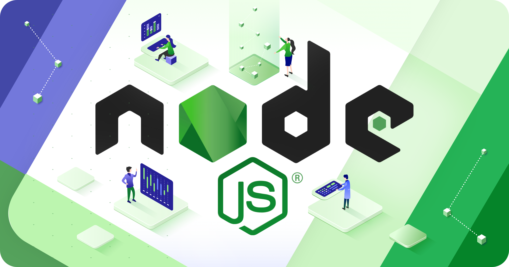
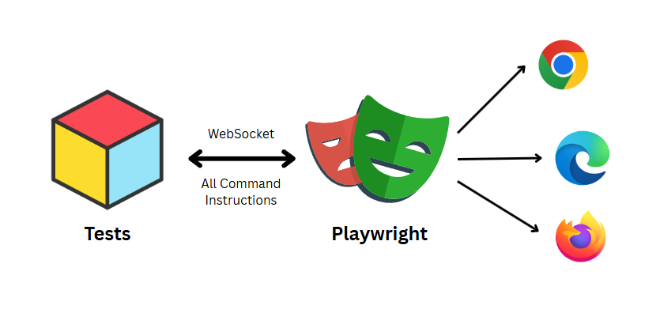
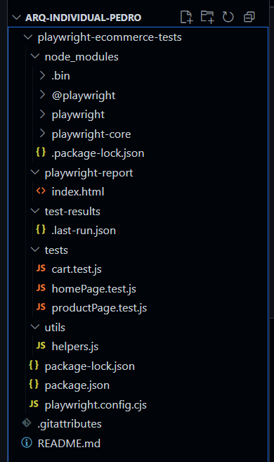
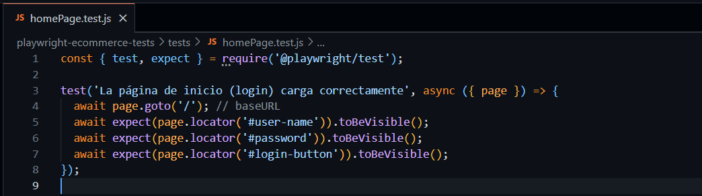
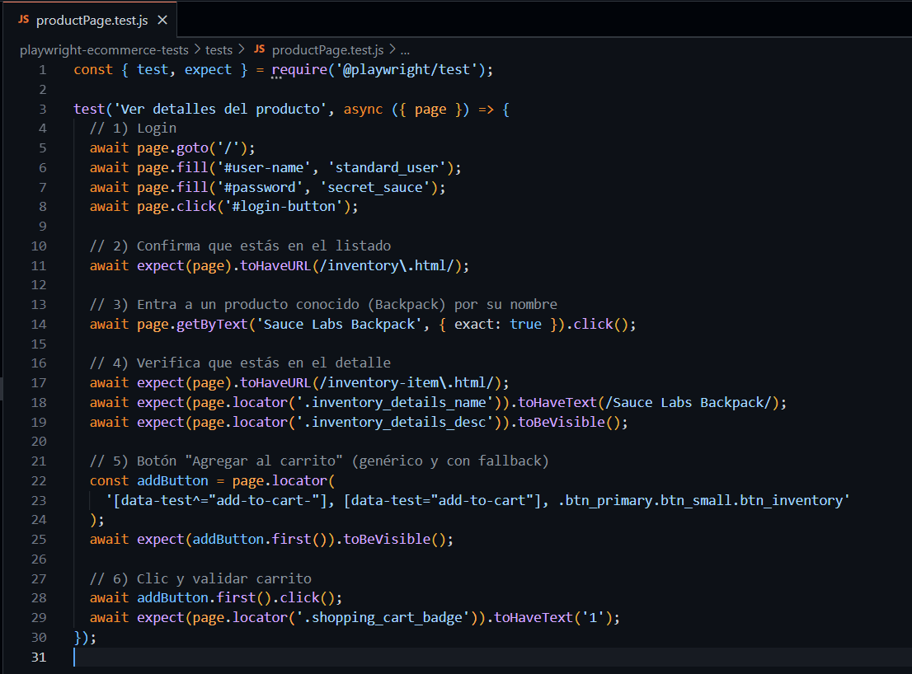
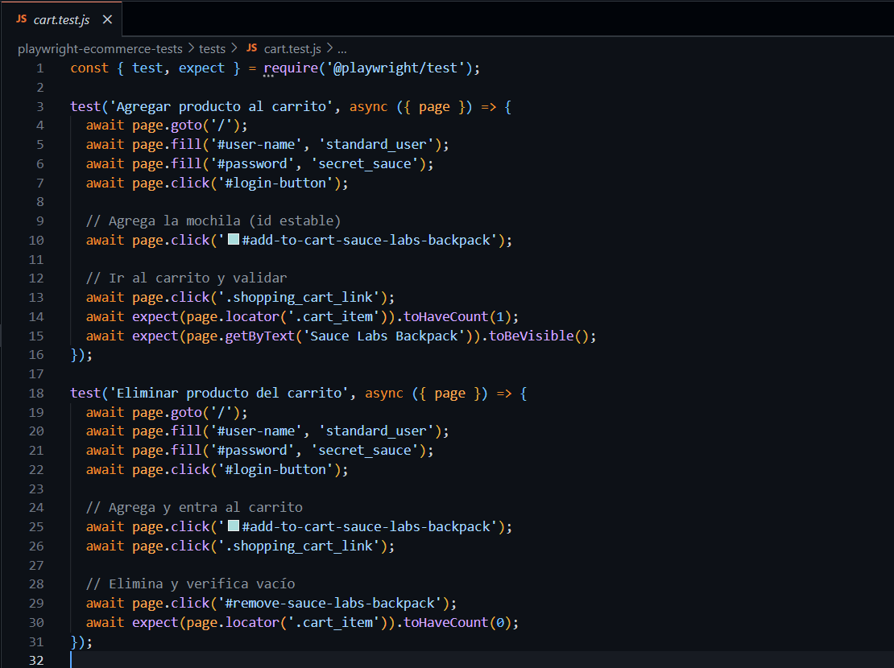
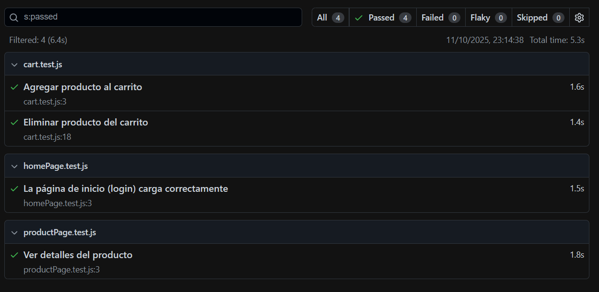

> [0. Acerca del Grupo](../../0.md) › [0.6. Temas Individuales (Parte 1)](../0.6.md) › [0.6.2. Integrante 2](0.6.2.md)

# 0.6.2. Pedro Morales

## 🧑🏻‍💻 Desarrollo Conceptual

### ¿Qué es la automatización de pruebas?

La automatización de pruebas consiste en el uso de **prácticas, frameworks y scripts** que permiten ejecutar pruebas de manera repetible, sin intervención manual, para validar que un software cumpla con sus requisitos funcionales y no funcionales (rendimiento, seguridad, usabilidad mínima). Esto ayuda a **reducir el tiempo de regresión, minimizar errores humanos** y aumentar la confiabilidad del software.

### Objetivos

- **Acelerar regresiones y releases:** Las pruebas se ejecutan automáticamente al hacer cambios en el código.  
- **Aumentar cobertura y detectar fallos temprano:** Validar todas las funcionalidades críticas antes de la entrega.  
- **Estandarizar evidencia para decisiones ‘go/no-go’:** Generar reportes automáticos que evidencien el estado de la aplicación.  
- **Integrarse al pipeline CI/CD:** Garantizar calidad continua en cada commit y release.

### Pirámide de Pruebas (aplicable a móvil y web)

| Capa | Qué valida | Ejemplo |
|------|-----------|---------|
| **Unitarias (Base)** | Lógica de negocio aislada, rápida | Validar cálculo de descuentos en Dart puro |
| **Componentes/UI (Widget/Golden)** | Render de widgets y estados | Validar que un botón de “Agregar al carrito” aparezca correctamente |
| **Integración** | Flujos entre módulos | Test de navegación de la página de inicio a la página de producto |
| **End-to-End (E2E)** | Escenarios reales en dispositivo/emulador | Validar flujo completo: buscar un producto, agregar al carrito y finalizar compra en Playwright |

> **Regla:** Muchas pruebas unitarias, menos E2E. E2E aportan confianza pero son más lentas y frágiles.

### Métricas Clave

- **Tiempo de ciclo:** Duración total de la suite de pruebas.  
- **Tasa de flakiness:** Porcentaje de tests inestables o que fallan aleatoriamente.  
- **Cobertura por capa:** Distribución de tests unitarios, de integración y E2E.  
- **MTTR (Mean Time To Repair):** Tiempo promedio para reparar fallos detectados.  
- **Defectos post-release:** Número de fallos críticos que se detectan en producción.

### Criterios para Elegir Herramientas

- **Compatibilidad con plataformas:** Android, iOS, web.  
- **Ecosistema y mantenimiento activo:** Comunidades grandes y documentación actualizada.  
- **Integración CI/CD:** Soporte para GitHub Actions, GitLab CI, Jenkins.  
- **Capacidad de device farm:** Posibilidad de ejecutar tests en múltiples dispositivos (Firebase Test Lab, AWS Device Farm, BrowserStack).  
- **Reportes y evidencia:** Generación automática de JUnit/Allure, screenshots y videos para facilitar el análisis.

## 👾 Consideraciones Técnicas

Estas consideraciones están pensadas para **personas que están empezando a programar** y quieren aprender a usar Playwright desde cero, ejecutando un proyecto de ejemplo como el e-commerce que desarrollamos.

---
---

### 1. Requisitos Previos

Antes de comenzar, necesitas instalar lo siguiente:

1. **Node.js**  
   - Es un entorno de ejecución para JavaScript.  
   - Descárgalo desde [https://nodejs.org](https://nodejs.org) y sigue las instrucciones de instalación.  
   - Para verificar que está instalado, abre una terminal y ejecuta:
     ```bash
     node -v
     npm -v
     ```

2. **Editor de código**  
   - Se recomienda **Visual Studio Code (VSCode)**.  
   - Descárgalo desde [https://code.visualstudio.com](https://code.visualstudio.com).



---

### 2. Crear el Proyecto

1. Abre la terminal o PowerShell.  
2. Crea una carpeta para tu proyecto y navega a ella:
   ```bash
   mkdir playwright-ecommerce
   cd playwright-ecommerce
   ```
3. Inicializa un proyecto en Node.js:
    ```bash
    npm init -y
    ```


### 3. Instalar **Playwright**

1. Instala Playwright y el paquete de pruebas:
    ```bash
    npm install playwright @playwright/test
   ```
2. Instala los navegadores que Playwright va a usar:
   ```bash
   npx playwright install
   ```
  


### 4. Estructura de Carpetas Recomendada

    playwright-ecommerce/
    │
    ├── tests/           # Carpeta donde estarán los scripts de pruebas
    │   ├── homePage.test.js
    │   ├── productPage.test.js
    │   └── cart.test.js
    │
    ├── utils/           # Funciones auxiliares
    │   └── helpers.js
    └── package.json



### 5. Escribir tu Primera Prueba

- homePage.test.js



- productPage.test.js



- cart.test.js



### 6. Ejecutar las Pruebas

1. Para ejecutar todas las pruebas, abre la terminal en la carpeta del proyecto y escribe:
    ```bash
    npx playwright test
    ```

2. Playwright ejecutará los tests y mostrará un resumen de resultados en la terminal.

### 7. Ejemplificación de Resultados

 

Todo salió bien: **los 4 tests pasaron** sin errores en ~5.3s.

- **Carrito**
  - Agregar producto → ✅ OK (1.6s)
  - Eliminar producto → ✅ OK (1.4s)
- **Inicio de sesión**
  - La página de login carga → ✅ OK (1.5s)
- **Producto**
  - Ver detalles del producto → ✅ OK (1.8s)

**En resumen:** la automatización está corriendo correctamente, los selectores funcionan y el flujo básico (login, ver producto y manejo de carrito) quedó validado.  
Si quieres ver el detalle con capturas y video, abre el reporte visual:

  ```bash
  npx playwright show-report
  ```
--- 

## 👾 Demo Código

Link de Github del Proyecto:
https://github.com/PedroM48/arq-individual-pedro.git

--- 

## 📹 Video de Presentación

Link de video: https://youtu.be/d4gtTPTZ190

---

[⬅️ Anterior](../0.6.1/0.6.1.md) | [🏠 Home](../../../README.md) | [Siguiente ➡️](../0.6.3/0.6.3.md)