> [0. Acerca del Grupo](../../0.md) › [0.6. Temas Individuales (Parte 1)](../0.6.md) › [0.6.3. Integrante 3](0.6.3.md)

# 0.6.3. Leonardo Salazar
# Desarrollo Conceptual de Observabilidad y Monitoreo

## 1. ¿Qué es la observabilidad y monitoreo?

La **observabilidad** es una táctica de calidad que permite comprender el estado interno de un sistema a partir de la información que este genera —como *logs*, *métricas* y *trazas*—. En otras palabras, mide qué tan “visible” es el comportamiento interno del sistema sin necesidad de modificarlo o detenerlo.

El **monitoreo**, por su parte, consiste en el proceso de recopilar, analizar y visualizar esa información para detectar fallos, degradaciones de rendimiento o comportamientos anómalos.  

Mientras la observabilidad busca ofrecer visibilidad, el monitoreo busca acción y respuesta ante lo observado.

En conjunto, ambas tácticas forman la base de la gestión proactiva de sistemas distribuidos, permitiendo detectar incidentes antes de que afecten al usuario final y facilitando el diagnóstico rápido cuando ocurren errores.

---

## 2. Origen y contexto

El concepto de **observabilidad** proviene de la teoría de control formulada por *Rudolf Kálmán* en la década de 1960, donde se definía como la capacidad de inferir el estado interno de un sistema dinámico a partir de sus salidas observables.

En el ámbito del **software moderno**, esta idea se adaptó al contexto de las **arquitecturas distribuidas y microservicios**, donde los componentes están aislados y la visibilidad global se vuelve un reto.  
Así, la observabilidad se convirtió en un principio clave para la **confiabilidad operativa (Site Reliability Engineering o SRE)**.

Actualmente, las soluciones de observabilidad abarcan tres pilares fundamentales:

- **Logs:** registros detallados de eventos o errores.  
- **Métricas:** valores numéricos sobre el rendimiento o estado del sistema.  
- **Trazas (Traces):** seguimiento de las solicitudes a través de múltiples servicios.

Estas herramientas permiten que un sistema no solo reaccione a fallos, sino que **aprenda de ellos** mediante alertas, paneles de control y análisis post-mortem.  
Plataformas como **Sentry**, **Prometheus**, **Grafana** o **Elastic APM** integran estos conceptos para ofrecer una visión completa del ciclo de vida del software.

---

## 3. Ventajas y desventajas

| **Ventajas** | **Desventajas** |
|---------------|------------------|
| Permite detectar y diagnosticar errores en tiempo real. | Requiere configuración y mantenimiento continuo de las herramientas. |
| Mejora la confiabilidad y rendimiento del sistema. | Puede generar sobrecarga de datos o costos por almacenamiento de logs y trazas. |
| Facilita el seguimiento de errores desde el frontend hasta el backend. | La integración inicial puede ser compleja en entornos distribuidos. |
| Proporciona alertas automáticas ante fallos o degradación del servicio. | Un mal manejo de datos sensibles podría comprometer la privacidad si no se filtran correctamente. |

---
## 4. Aplicación en el proyecto

En el proyecto **StoreLite**, la táctica de **Observabilidad y Monitoreo** se implementó utilizando **Sentry** como herramienta principal.  
Su integración se realizó en **dos niveles del sistema**:


### Frontend (React)

- Se configuró el cliente de **Sentry** en el archivo `main.jsx` para capturar errores y excepciones del navegador.  
- parte de la aplicación está envuelta por un componente `ErrorBoundary`, que intercepta fallos en la interfaz y muestra un mensaje claro al usuario —por ejemplo:  
  > “Ha ocurrido un error 😢”  

  mientras el error se registra automáticamente en Sentry.

Esto garantiza que el sistema sea **tolerante a fallos en la interfaz**, evitando bloqueos totales y facilitando el diagnóstico posterior en el panel de Sentry.

- Cada producto puede ser seleccionado por el usuario, y al presionar el botón **Buy**, se genera una nueva orden que es registrada en el backend.

- Por ultimo, se agrego un boton debajo para lanzar un error a proposito para probar la funcionalidad de Sentry


### Backend (FastAPI)

En el lado del servidor, se añadió el **SDK de Sentry** para capturar errores de las rutas y excepciones no controladas.

Se implementó un **flujo funcional** que relaciona los **orders** con los **products**.  


Durante la validación de este proceso se añadieron **manejadores de errores controlados y no controlados** para probar la eficacia del monitoreo. 

Por ejemplo, si el backend esta caido o hay un error en el formato de la orden, el sistema captura la excepción y la envía automáticamente a **Sentry**, junto con el **contexto de la solicitud** y los **datos enviados**.

---

De esta manera, los errores generados tanto en el **cliente** como en el **servidor** aparecen **centralizados en el panel de Sentry**, donde pueden visualizarse con su traza completa, contexto del entorno, tipo de error y los pasos que llevaron al fallo (*breadcrumbs*).

Además, **Sentry** permite definir **alertas automáticas** por correo o Slack, activadas cuando se detecta un error nuevo, repetitivo o crítico, lo cual **mejora la capacidad de respuesta** y **reduce el tiempo medio de detección de fallos (MTTD)**.

---

# Consideraciones técnicas

### 1. Requisitos

Tener instalado Docker y Docker Compose. Se puede descargar a traves de este [link](https://www.docker.com/products/docker-desktop/) con la opcion "Download Docker Desktop" y seguir la condiguración default

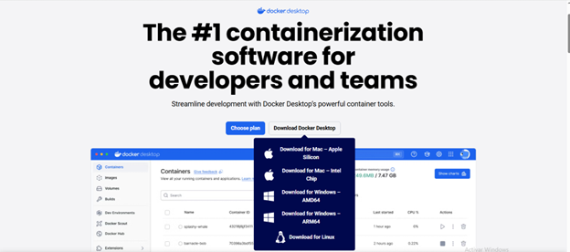

Todos los servicios se levantan de manera automática y consistente gracias a Docker Compose, sin necesidad de instalaciones extras.

Ademas de crearte una cuenta en [Sentry](https://sentry.io/welcome/?utm_source=google&utm_medium=cpc&utm_id={20403208976}&utm_campaign=Google_Search_Brand_SentryKW_ROW_Alpha&utm_content=g&utm_term=sentry&gad_source=1&gad_campaignid=20403208976&gbraid=0AAAAADua1WJ2lcwzbUcA5mSA1J9_xTYKX&gclid=Cj0KCQjwo63HBhCKARIsAHOHV_WMxcCDFHNYLC7-G237FhXWtc--US25CYEQyTNj88bzLusSoy5mhbQaAqXFEALw_wcB) a travez de la opcion "TRY SENTRY FOR FREE"

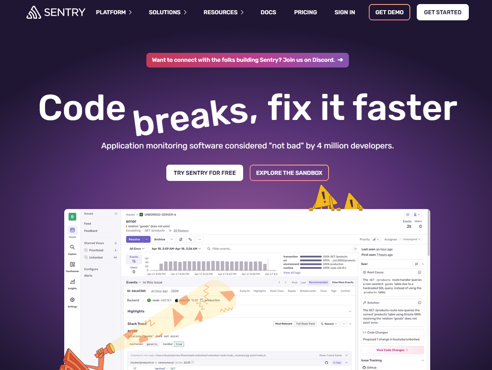

Una vez creada tu cuenta, te tendrias que dirigir hacia Settings - Projects - Create project

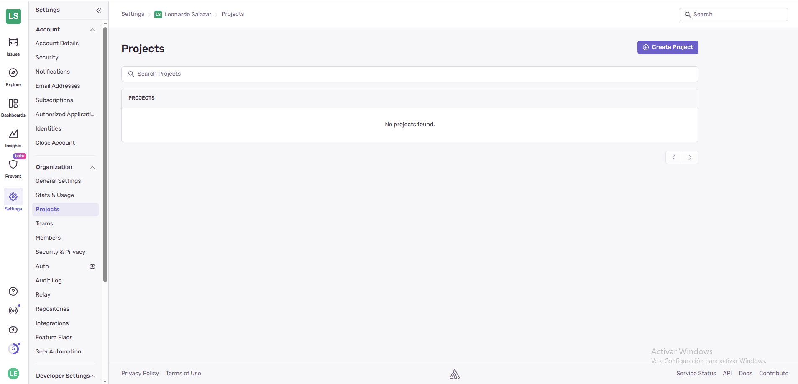

En la creacion de proyecto selecciona las opciones mostradas en la imagen

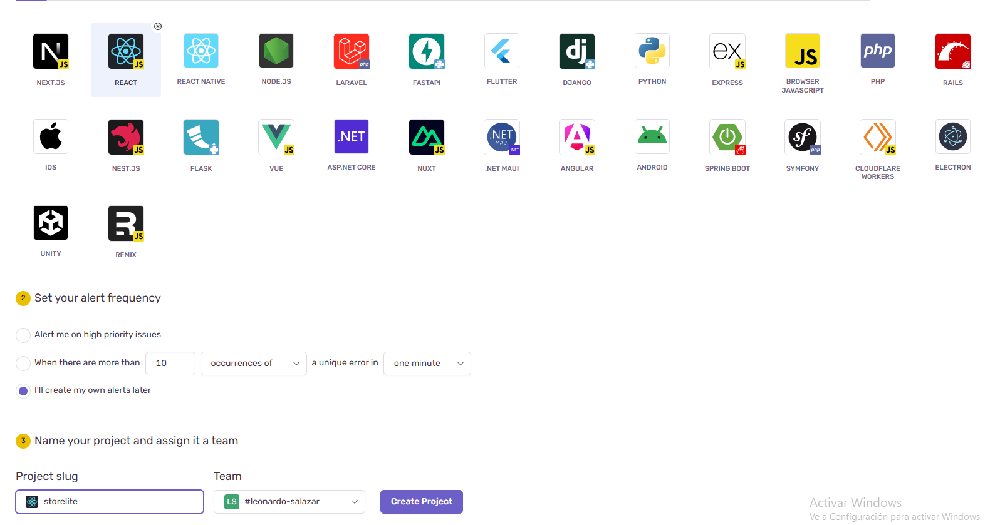

Una vez creado, ahora nos dirijimos hacia Insights - Projects - storelite (o el nombre que le pusiste al proyecto) - Engranaje en la esquina superior izquierda

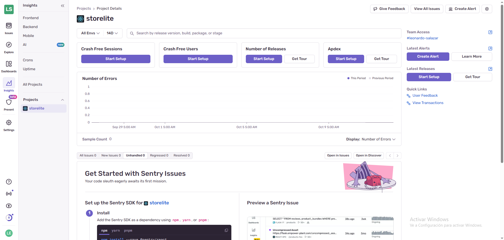

Luego en la barra vertical de la izquierda busca la opcion SDK Setup - Client Keys (DSN)

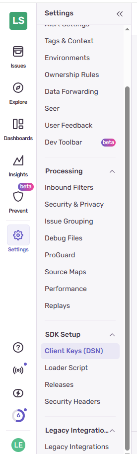

Dentro de este apartado estara tu DSN que te servira para vincular cualquier implementacion a Sentry y poder empezar a hacer cosas con este.

## 2. Configuración

Clonar el repositorio del proyecto:

```bash
git clone https://github.com/ulima-arqsoft/arqui252-grupo5.git
```

y luego entrar en la carpeta donde se encuentra el proyecto con:

```bash
cd 0/0.6/0.6.3/storelite
```

Por ultimo, se tendran que crear 2 archivos **.env**

El primero debe ir en la raiz del proyecto (storelite) y debe tener:

```bash
SENTRY_DSN="COLOCAR TU PROPIA DSN"
FRONTEND_URL=http://localhost:5173
BACKEND_URL=http://localhost:8000
```
El segundo debe ir dentro de la carpeta frontend y debe tener:

```bash
VITE_SENTRY_DSN="COLOCAR TU PROPIA DSN"
VITE_API_URL=http://localhost:8000
```
## 3. Ejecución

Desde la carpeta raíz del módulo, ejecutar:

```bash
docker-compose up
```

Esto iniciará automáticamente los siguientes servicios:

- 🗄️ **Redis** (puerto `6379`)  
- ⚙️ **Backend FastAPI** (puerto `8000`)  
- 💻 **Frontend React** (puerto `5173`)  

La ejecución puede visualizarse en **Docker Desktop**

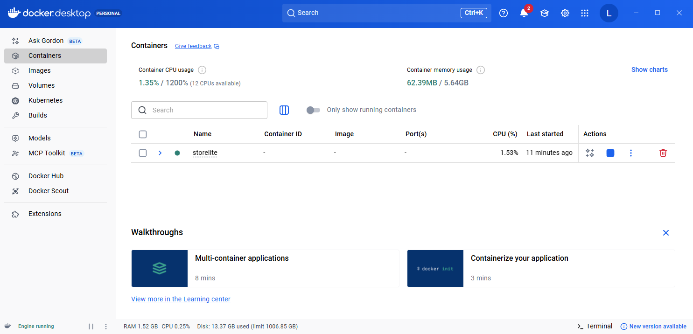

Seleccionando el contenedor storelite se podra apreciar que todos los servicios se encuentran activos y en ejecución.

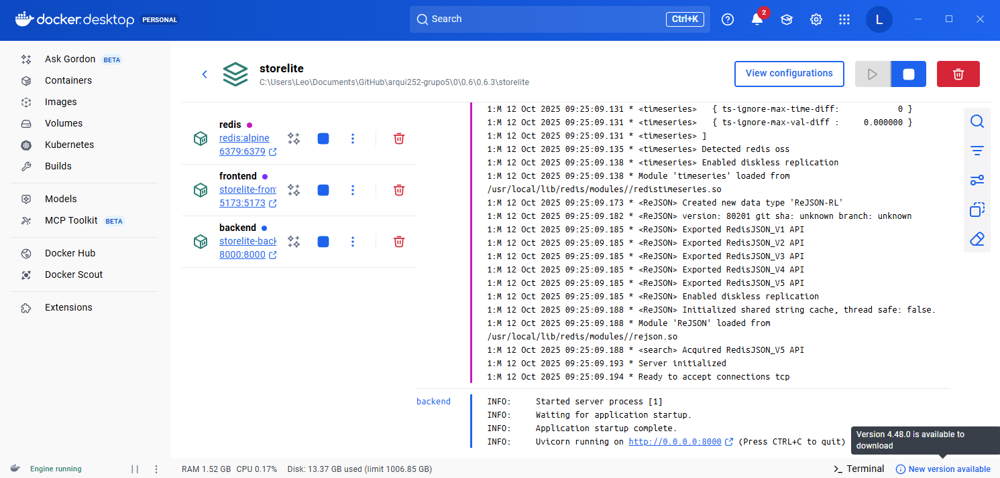

---

## 4. Preparación para pruebas

Tener abierto en el navegador: 

- [http://localhost:5173](http://localhost:5173) para tener el frontend
- [http://localhost:8000](http://localhost:8000) para tener el backend
- Sentry en Insights - Projects - storelite (o el nombre que le pusiste al proyecto) **(esta pantalla pasara a llamarse como "Detalles del proyecto" para el resto de este documento)**

---

## 5. Pruebas de observabilidad y monitoreo

|  **Objetivo** |  **Acción** |  **Cómo verlo en Sentry** |  **Resultado esperado** |
|-----------------|---------------|------------------------------|---------------------------|
| **1️⃣ Capturar error manual y excepción en backend** | Abrir en el navegador:<br>👉 [http://localhost:8000/test/error](http://localhost:8000/test/error) | En la parte inferior de **detalles del proyecto** aparecen dos eventos:<br>- Message: “Manual error triggered 🚨”<br>- Exception: “Simulated error for Sentry testing!”<br>Al presionarlos se muestran sus detalles. | Sentry muestra el **stack trace** y la línea exacta del error en el código **Python**. |
| **2️⃣ Error controlado desde frontend (React)** | En el frontend, hacer clic en el botón **“Probar error”** del carrito. | En la parte inferior de **detalles del proyecto**, aparece un nuevo evento:<br>“Error manual en el render del carrito 🧨”. | El frontend muestra el mensaje:<br>“Ha ocurrido un error 😢”<br>y Sentry guarda el **stack trace de React** y la **sesión del usuario**. |
| **3️⃣ Capturar errores de red (Axios / Orders)** | 1️⃣ Tener abierto el frontend en el navegador.<br>2️⃣ Detener el backend desde **Docker Desktop**.<br>3️⃣ En el frontend, presionar **Buy** en cualquier producto. | En la parte inferior de **detalles del proyecto**, aparece un error tipo **Network / AxiosError**.<br>En “Breadcrumbs” se ven las peticiones HTTP previas. | Se muestra la alerta:<br>❌ “Error al crear la orden...”<br>y en Sentry se registra el **fallo de red con contexto** y la **secuencia de pasos del usuario**. |
| **4️⃣ Capturar logs manuales del backend** | Abrir:<br>👉 [http://localhost:8000/simulate/log](http://localhost:8000/simulate/log) | En la parte inferior de **detalles del proyecto**, se registran los mensajes enviados por el logger (**info**, **warning**, **error**). | En los **breadcrumbs del evento** se visualizan los tres niveles de log. |
| **5️⃣ Session Replay (reproducción de sesión)** | 1️⃣ Mover el mouse en la pantalla del frontend.<br>2️⃣ Provocar un error (clic en “Probar error”). | Aparece un nuevo evento de un *issue* ya existente:<br>“Error manual en el render del carrito 🧨”.<br>Dentro del evento, aparece el apartado **Session Replay**, donde se muestra la grabación de la sesión. | Se visualiza el **recorrido del usuario**, sus **acciones** y el **momento exacto del error en video**. |
| **6️⃣ Performance y trazas (tiempos de respuesta)** | Refrescar el **Home** y observar la carga de productos (`/products/`). | En **Insights → Frontend → Transactions** (parte inferior de la pantalla), seleccionar `/products/`. | Se muestra la **duración del request**, la **latencia** y los **spans** del frontend y backend conectados. |
| **7️⃣ Alertas customizadas** | En **Sentry → Detalles del proyecto → Create Alert**<br>Crear regla siguiendo la imagen de referencia que esta mas abajo en el documento. | En **Issues → Alerts**, se visualiza la regla creada y el historial de activaciones.<br>Además, se recibe la notificación configurada (email/Slack). | Al provocar el error que cumpla la condición, **Sentry dispara la alerta** y te notifica.<br>El evento de activación queda registrado en el historial de la regla. |

---

## Pantallas de referencias de UI de Sentry

### Settings de la alerta a crear en el paso 7
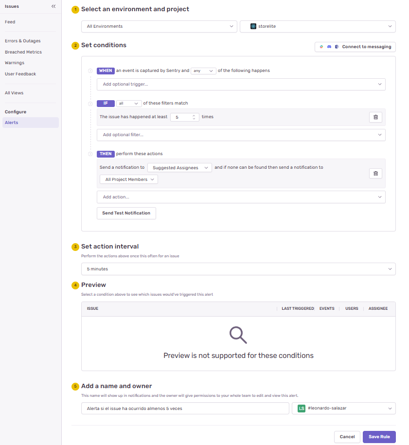

### Detalles del proyecto
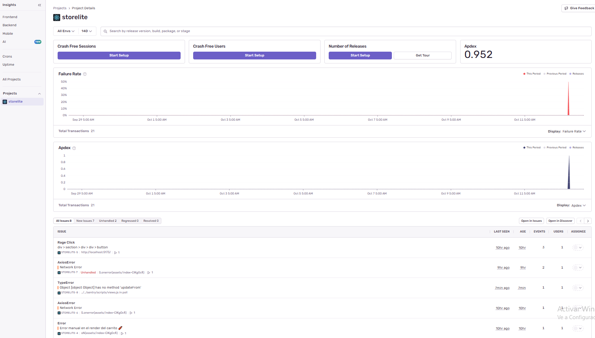

### Detalles del frontend


### Detalles del backend
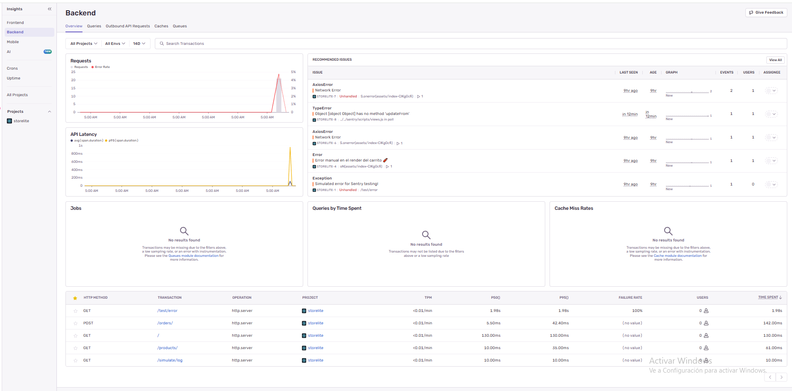

### Alertas creadas
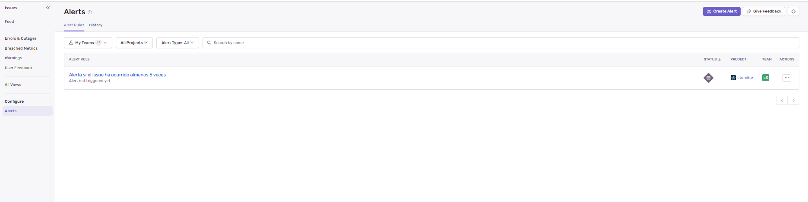

---
# Video de demostracion

[Link del video](https://youtu.be/owDFjd3WVkY)

---

[⬅️ Anterior](../0.6.2/0.6.2.md) | [🏠 Home](../../../README.md) | [Siguiente ➡️](../0.6.4/0.6.4.md)