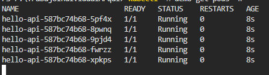

> [0. Acerca del Grupo](../../0.md) › [0.6. Temas Individuales (Parte 1)](../0.6.md) › [0.6.4. Integrante 4](0.6.4.md)

# 0.6.4. Ana Meza
---
# 🧠 Desarrollo Conceptual — Orquestación de Contenedores

## ✅ ¿Qué es?
La **orquestación de contenedores** es el conjunto de prácticas y componentes que automatizan el **despliegue, escalado, actualización y operación** de aplicaciones en contenedores sobre un **clúster**. Funciona de forma **declarativa**: defines el *estado deseado* (p. ej., “3 réplicas de este servicio”) y el orquestador lo mantiene mediante **reconciliación**, gestionando redes, almacenamiento, secretos, políticas y observabilidad.

### 🖇️ ¿Qué es un clúster?
Un **clúster** es un **conjunto de máquinas** (físicas o virtuales) que operan como un sistema único:
- **Plano de control**: decide y coordina (API, scheduler, controladores).
- **Nodos de trabajo** (*workers*): ejecutan los contenedores/pods.
- Comparten **red** y, cuando aplica, **almacenamiento**, habilitando **alta disponibilidad** y **escalado** al distribuir la carga y reemplazar instancias con fallas automáticamente.

---

## 🌟 ¿Por qué usar un orquestador?
- **Alta disponibilidad y autorreparación** (recrea pods si fallan).
- **Escalabilidad horizontal automática** (HPA/VPA) según carga o métricas.
- **Despliegues seguros y sin caída**: *rolling*, *blue/green*, *canary* y **rollback**.
- **Estandarización operativa** (red, volúmenes, secretos, políticas).
- **Uso eficiente de recursos** (bin-packing con *requests/limits*).
- **Observabilidad** integrada (métricas, logs, trazas) para SRE.

---

## 🟩 Cuándo conviene
- **Microservicios** o múltiples servicios que deben alinearse.
- **Picos de demanda** y necesidad de **autoscaling**.
- **Entornos multi-equipo** con cuotas, aislamiento y políticas.
- **Entrega continua** con despliegues frecuentes y *rollback* ágil.
- **Plataformas internas** (PaaS) que hospedan varios productos.

## 🟥 Cuándo *no* conviene
- Proyectos **pequeños/estáticos** (un servicio simple sin escalar).
- Equipos **sin capacidad operativa** para administrar un clúster.
- Workloads con **dependencias muy host-acopladas**.
- Requisitos de **tiempo real duro** donde la sobrecarga no es aceptable.

---

## ⚠️ Desafíos y riesgos (a gestionar)
- **Curva de aprendizaje** y complejidad operativa.
- **Costos** por sobredimensionamiento o *requests/limits* mal definidos.
- **Seguridad**: exfiltración de secretos, imágenes vulnerables, red abierta.
- **Observabilidad** insuficiente complica diagnóstico y *MTTR*.

---

## 🧩 Componentes y conceptos clave (agnósticos)
| Capa | Qué hace | Ejemplos |
|---|---|---|
| **Plano de control** | Mantiene estado deseado y programa cargas | API Server, Scheduler, Controladores |
| **Plano de datos** | Ejecuta contenedores y expone red/volúmenes | Nodos de trabajo + runtime |
| **Red (CNI)** | Conectividad y políticas L3/L4 | Calico, Cilium, Flannel |
| **Almacenamiento (CSI)** | Provisión de volúmenes y *claims* | HostPath, NFS, Ceph |
| **Identidad y acceso** | Permisos por rol | RBAC, ServiceAccounts |
| **Observabilidad** | Métricas, logs, trazas | metrics-server, Prometheus/Grafana, Loki/ELK, OpenTelemetry |

---

## 🛠️ Objetos/patrones típicos
| Objeto/Patrón | Qué resuelve | Ejemplo |
|---|---|---|
| **Deployment** | Réplicas y estrategia de actualización | 3 pods con *rolling update* 25%/25% |
| **Service** | Descubrimiento y balanceo L4 | `ClusterIP` (interno), `NodePort/LoadBalancer` (externo) |
| **Ingress / Gateway** | Enrutamiento HTTP/HTTPS L7 | Ruta `/api` → servicio `backend` con TLS |
| **ConfigMap / Secret** | Config y credenciales fuera del código | `APP_MODE=prod`, token base64 |
| **Job / CronJob** | Tareas puntuales o programadas | ETL diario 03:00 |
| **HPA / VPA** | Autoscaling por métricas o ajuste de recursos | Escalar si CPU > 70% |
| **NetworkPolicy** | Control de tráfico entre pods | Solo `frontend` → `api` |

---

## 🔁 Estrategias de despliegue
| Estrategia | Úsala cuando… | Trade-off |
|---|---|---|
| **Rolling Update** | Cambios frecuentes con bajo riesgo | Mínimo riesgo; propagación gradual |
| **Recreate** | Incompatibilidad de estado/sesiones | Downtime breve |
| **Blue/Green** | Cambios grandes; *rollback* instantáneo | Requiere doble capacidad |
| **Canary** | Validar con % pequeño de tráfico | Mayor complejidad de ruteo/telemetría |

---

## 📏 Métricas clave de operación
- **Disponibilidad (SLA/SLO)** y **error rate** por servicio.  
- **Latencias** P50/P95/P99 en endpoints críticos.  
- **CPU/RAM** usados vs *requests/limits* (evitar *throttling* y **OOMKilled**).  
- **Tiempo de despliegue** y **tasa de rollback**.  
- **MTTR** ante fallas y **saturación** (colas, conexiones, límites de pod/nodo).

---

## 📚 Glosario rápido
- **Pod**: unidad mínima de ejecución (uno o más contenedores).  
- **ReplicaSet**: mantiene el número de pods.  
- **Namespace**: segmentación lógica de recursos.  
- **CNI/CSI**: interfaces de red/almacenamiento para plugins.  
- **GitOps**: manifiestos en Git como **fuente de verdad** y reconciliación continua.

> **Nota:** Este marco es **independiente del proveedor** (Kubernetes, Nomad, Swarm). La demo del repositorio se ejecutará en un **clúster local** con manifiestos YAML estándar.

## **DEMO**
> **Objetivo:** Desplegar una app HTTP simple en Kubernetes local, exponerla, escalarla, hacer un rolling update y demostrar autorreparación.  
> **Entorno usado:** Windows + Docker Desktop + `kubectl` + `kind` v1.30.0

---

## 0) Requisitos previos

- Docker Desktop/Engine activo  
- `kubectl` instalado  
- `kind` instalado  
- 2 vCPU y 4 GB RAM libres

Verificación rápida:
```powershell
docker --version
kubectl version --client
kind --version
```
## 1) Crear el clúster local
```powershell
kind create cluster --name demo-orq --image kindest/node:v1.30.0
kubectl cluster-info --context kind-demo-orq
kubectl get nodes
```
## 2) Preparar la imagen en el clúster (evitar ImagePullBackOff)
```powershell
docker pull hashicorp/http-echo:0.2.3
kind load docker-image hashicorp/http-echo:0.2.3 --name demo-orq
```
## 3) Crear manifiesto YAML (namespace, deployment y service)
```powershell
mkdir k8s -Force
notepad .\k8s\demo.yaml
```

Pegas esto: 
```powershell
apiVersion: v1
kind: Namespace
metadata:
  name: demo
---
apiVersion: apps/v1
kind: Deployment
metadata:
  name: hello-api
  namespace: demo
spec:
  replicas: 3
  selector:
    matchLabels:
      app: hello-api
  strategy:
    type: RollingUpdate
    rollingUpdate:
      maxUnavailable: 1
      maxSurge: 1
  template:
    metadata:
      labels:
        app: hello-api
    spec:
      securityContext:
        runAsNonRoot: true
        runAsUser: 10001
      containers:
        - name: app
          image: hashicorp/http-echo:0.2.3
          imagePullPolicy: IfNotPresent
          args: ["-text=Hola desde Kubernetes 👋", "-listen=:8080"]
          ports:
            - containerPort: 8080
          resources:
            requests: { cpu: "50m", memory: "64Mi" }
            limits:   { cpu: "200m", memory: "128Mi" }
          livenessProbe:
            httpGet: { path: "/", port: 8080 }
            initialDelaySeconds: 5
            periodSeconds: 10
          readinessProbe:
            httpGet: { path: "/", port: 8080 }
            initialDelaySeconds: 2
            periodSeconds: 5
---
apiVersion: v1
kind: Service
metadata:
  name: hello-svc
  namespace: demo
spec:
  type: NodePort
  selector:
    app: hello-api
  ports:
    - name: http
      port: 80
      targetPort: 8080
      nodePort: 30080
```
Aplicar y verificar:
```powershell
kubectl apply -f .\k8s\demo.yaml
kubectl -n demo get deploy,rs,pods,svc -o wide
```
## 4) Acceder al servicio (port-forward)
En Windows + kind, el NodePort puede no abrirse en localhost(a mi me salio ese error unu). Para la demo usamos port-forward:
```powershell
kubectl -n demo port-forward svc/hello-svc 18180:80
```
Deja esa consola abierta. En otra consola o navegador:
```powershell
curl.exe http://127.0.0.1:18180/
```
## 5) Escalado sin caída
```powershell
kubectl -n demo scale deploy/hello-api --replicas=5
kubectl -n demo get deploy,rs,pods -o wide
```


## 6) Rolling update (cambio visible) y rollback
Edita el Deployment para actualizar el mensaje:
```powershell
kubectl -n demo edit deploy/hello-api
```
Cambia el bloque args a:
```powershell
args:
  - "-text=Hola desde K8s v2 🚀"
  - "-listen=:8080"
```
Guarda y espera el rollout:
```powershell
kubectl -n demo rollout status deploy/hello-api
```
Refresca la URL http://127.0.0.1:18180/ — verás el nuevo texto.


## 7) Autorreparación (self-healing)
```powershell
kubectl -n demo delete pod -l app=hello-api --force --grace-period=0
kubectl -n demo get pods -w
```
## 8) Comprobaciones y evidencias
```powershell
kubectl get nodes
kubectl -n demo get deploy,rs,pods,svc -o wide
kubectl -n demo describe deploy/hello-api
kubectl -n demo logs -l app=hello-api --tail=50
```

## Resumen final de lo realizado
- Despliegue declarativo (Deployment + Service)

- Descubrimiento y exposición del servicio

- Escalado horizontal sin caída

- Rolling update (y rollback)

Autorreparación automática
[⬅️ Anterior](../0.6.3/0.6.3.md) | [🏠 Home](../../../README.md) | [Siguiente ➡️](../0.6.5/0.6.5.md)