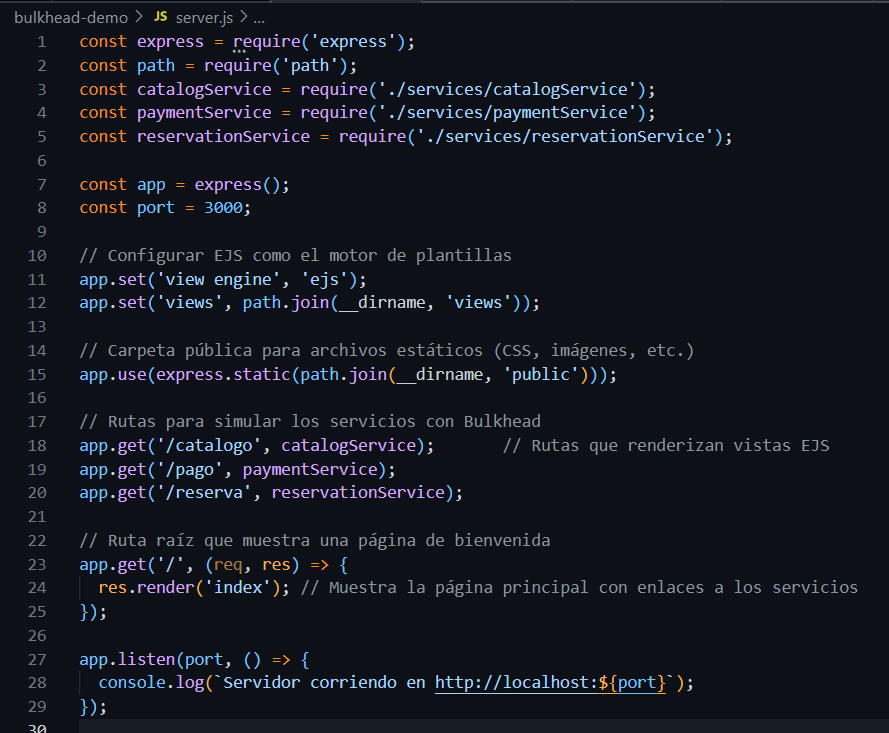
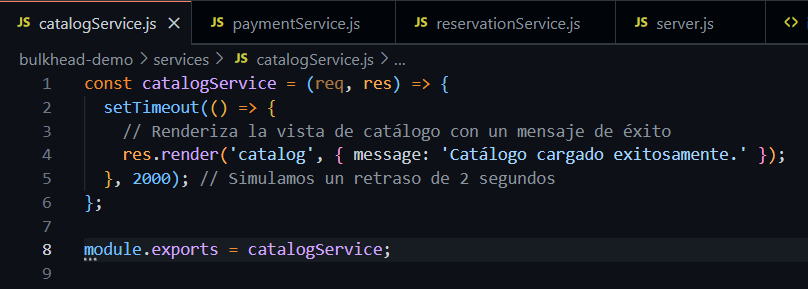
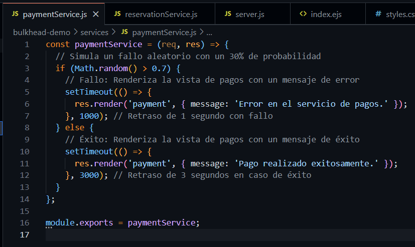
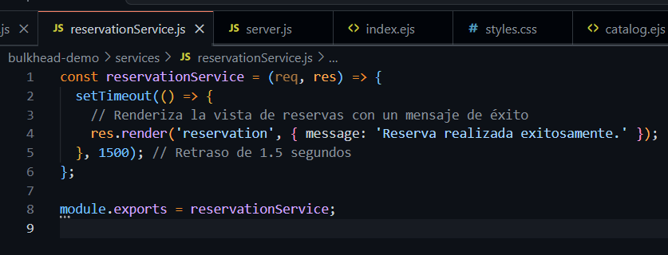
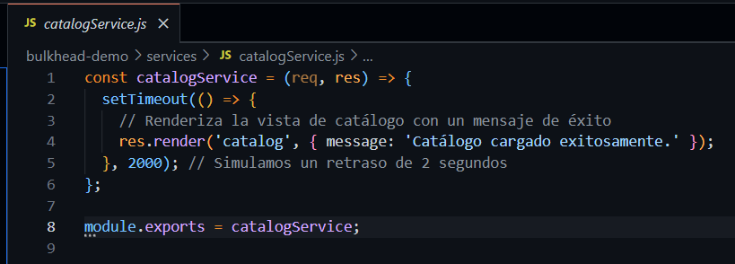
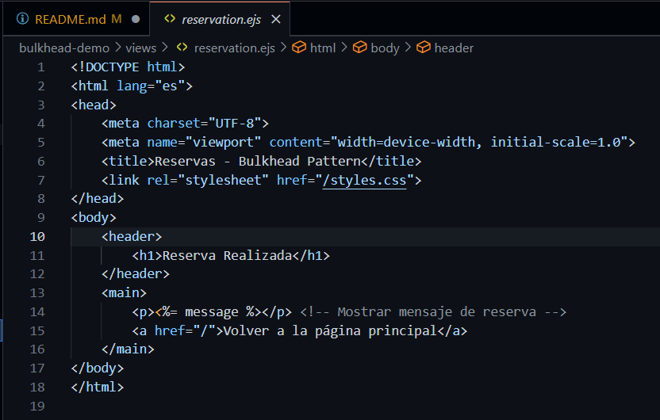
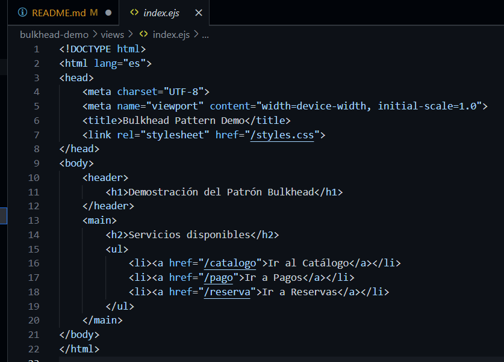

> [0. Acerca del Grupo](../../0.md) › [0.7. Trabajo Individual (Patrones Cloud)](../0.7.md) › [0.7.2. Integrante 2](0.7.2.md)

# 0.7.2. Pedro Morales

## 🧑🏻‍💻 Desarrollo Conceptual

### ¿Qué es el Patrón Bulkhead?

El patrón **Bulkhead** (o **Compartimentación Aislada**) es un diseño arquitectónico que consiste en **dividir la aplicación en compartimentos independientes**, de manera que si una parte falla o se sobrecarga, **el resto del sistema continúe funcionando con normalidad**.

El nombre proviene de la estructura de los barcos, donde el casco se divide en secciones selladas para evitar que una filtración hunda toda la nave.

Aplicado al software, Bulkhead ayuda a:

- **Reducir el impacto de fallos internos o externos.**
- **Evitar fallas en cascada** entre módulos o servicios.
- **Mantener disponibilidad parcial** incluso bajo condiciones de error o carga alta.

### Objetivos

- **Aislar recursos críticos:** Evitar que un servicio consuma todos los recursos disponibles.
- **Evitar colapsos totales:** Permitir que el sistema siga funcionando aun si un módulo falla.
- **Garantizar continuidad de operaciones:** Mantener funcionalidad esencial bajo estrés.
- **Mejorar resiliencia:** El sistema responde mejor ante fallas externas o intermitentes.
- **Soportar picos de carga:** Los servicios críticos tienen prioridad en el uso de recursos.

### Arquitectura del Patrón (equivalente a una pirámide conceptual)

| Capa / Nivel | Qué Representa | Ejemplo Aplicado |
|-------------|---------------|----------------|
| **Compartimentos (Base)** | Separación física o lógica de recursos | Pool independiente para Pagos |
| **Limitación de Concurrencia** | Definición de cuántas peticiones se procesan | Límite de 10 hilos para reservas simultáneas |
| **Fallback / Continuidad Parcial** | Mantener funciones disponibles incluso en falla | Notificaciones pueden retrasarse sin problema |
| **Supervisión y Monitoreo** | Alertas, métricas y logs por compartimento | Métricas por servicio en Azure Monitor o Grafana |

> **Regla:** Los servicios críticos deben estar **siempre aislados** de los servicios de soporte.

### Métricas Clave

- **Tasa de Saturación de Recursos:** Nivel de uso por pool o contenedor.
- **Tiempo de Respuesta por Servicio:** Permite identificar cuellos de botella.
- **Tasa de Fallas Aisladas:** Indica si la compartimentación está funcionando.
- **Disponibilidad Parcial:** Porcentaje de la aplicación que permanece operativa durante fallas.
- **MTTR:** Tiempo promedio para recuperar un compartimento afectado.

### Criterios para Diseñar con Bulkhead

- **Identificar servicios críticos:** ¿Qué debe seguir funcionando sí o sí?
- **Separar recursos por servicio:** Conexiones, hilos, contenedores.
- **Evaluar carga esperada:** Permite definir límites de concurrencia reales.
- **Monitorear continuamente:** Detectar temprano saturación o fallos.
- **Combinar con otros patrones:** Circuit Breaker, Retry y Throttling aumentan resiliencia.

## 👾 Consideraciones Técnicas

En términos prácticos, Bulkhead es:

- Dividir el sistema en secciones independientes.
- Si una sección falla, solo esa parte se ve afectada.
- Mantiene el resto del sistema funcionando sin problemas.
- Ejemplo: Si el servicio de pagos falla, el catálogo y las reservas siguen operando.

Como analogía es como compartimentar un barco: "*Si una sección se llena de agua, no se hunde todo el barco*".

Estas consideraciones están pensadas para **equipos que comienzan con arquitectura de microservicios** y buscan mejorar **resiliencia en entornos cloud**.

---
---

## 1. Requisitos Previos

Antes de comenzar, necesitas instalar lo siguiente:

1. **Node.js**  
   - Es un entorno de ejecución para JavaScript.  
   - Descárgalo desde [https://nodejs.org](https://nodejs.org) e instala la versión recomendada.  
   - Para verificar que está instalado, abre una terminal y ejecuta:
     ```bash
     node -v
     npm -v
     ```

2. **Editor de código**  
   - Se recomienda **Visual Studio Code (VSCode)**.  
   - Descárgalo desde [https://code.visualstudio.com](https://code.visualstudio.com).

## 2. Crear el Proyecto

1. Abre la terminal o PowerShell.
2. Crea una carpeta y navega a ella:
   ```bash
   mkdir bulkhead-demo
   cd bulkhead-demo
    ```
3. Inicializa el Proyecto en Node.js
    ```bash
   npm init -y
    ```

## 3. Instalar **Express, EJS y Bottleneck**

1. Instala Express (servidor web) y Bottleneck (para manejar la concurrencia y simular el patrón Bulkhead):
    ```bash
    npm install express bottleneck
    ```
2. Instala EJS (motor de plantillas):
    ```bash
    npm install ejs
    ```

## 4. Estructura de Carpetas Recomendada

    bulkhead-demo/
    ├── public/               
    │   └── styles.css  
    ├── services/              
    │   ├── catalogService.js
    │   ├── paymentService.js
    │   └── reservationService.js
    ├── views/                 
    │   ├── index.ejs          
    │   ├── catalog.ejs        
    │   ├── payment.ejs    
    │   └── reservation.ejs   
    ├── server.js           
    └── package.json

## 5. Configura tu Servidor Principal 

Configurar Express, EJS y las rutas para los servicios de catálogo, pago y reserva:

- server.js



## 6. Configura tu Servicios

- catalogService.js



- paymentService.js



- reservationService.js



## 7. Plantear las Vistas EJS

- catalogService.js



- paymentService.js


- reservationService.js



- index.ejs



## 8. Ejecutar el Proyecto

Ejecuta el servidor con el siguiente comando:
    
    node server.js


Abre tu navegador y accede a las rutas:

- Página principal: http://localhost:3000/
    
    - Catálogo: http://localhost:3000/catalogo
    
    - Pago: http://localhost:3000/pago
    
    - Reserva: http://localhost:3000/reserva

---

## 👾 Demo Código

Link de Github del Proyecto:
https://github.com/PedroM48/arq-individual02-pedro.git

--- 

[⬅️ Anterior](../0.7.1/0.7.1.md) | [🏠 Home](../../../README.md) | [Siguiente ➡️](../0.7.3/0.7.3.md)