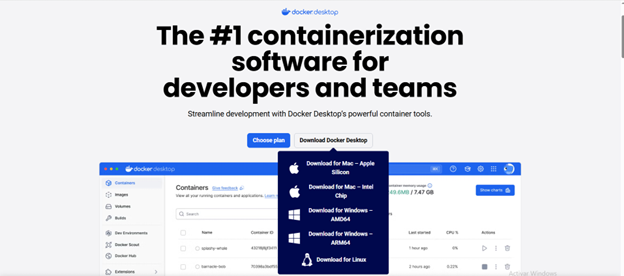
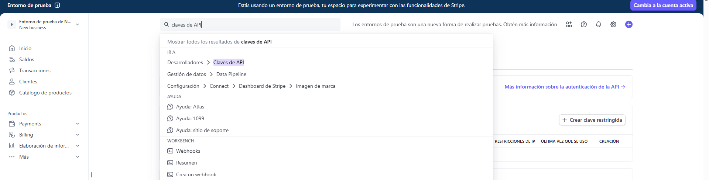
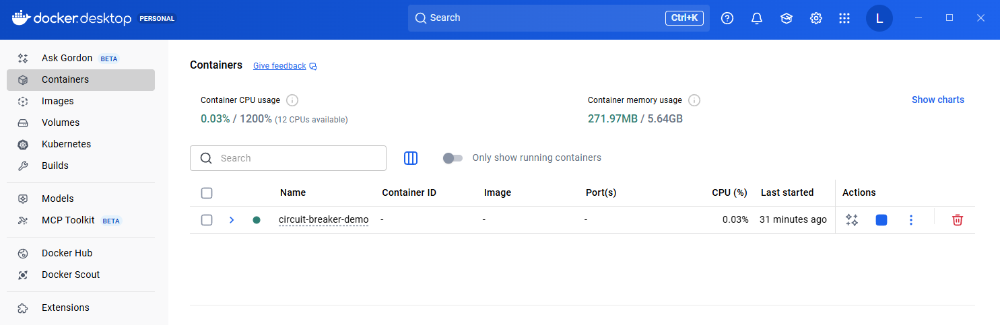
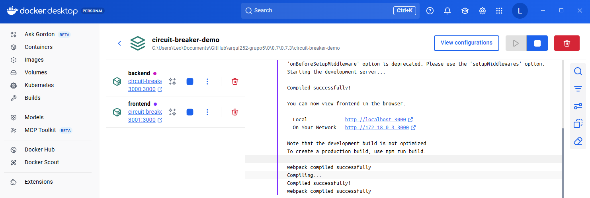
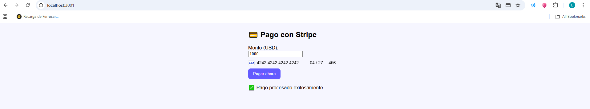
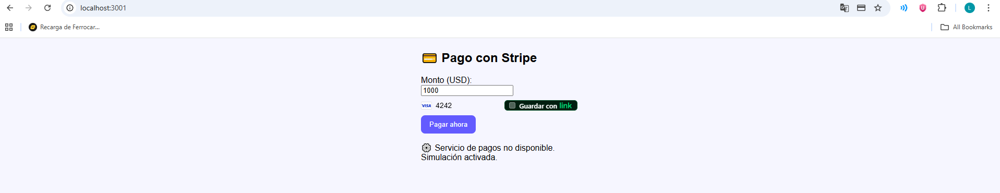
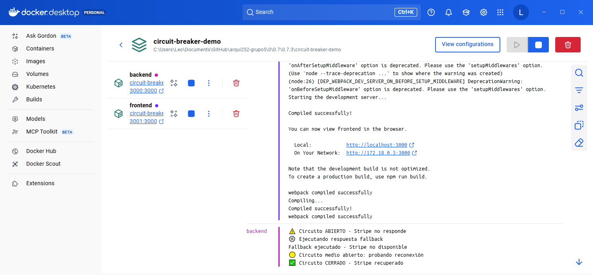

> [0. Acerca del Grupo](../../0.md) › [0.7. Trabajo Individual (Patrones Cloud)](../0.7.md) › [0.7.3. Integrante 3](0.7.3.md)

# 0.7.3. Leonardo Salazar

# Desarrollo del patrón: Disyuntor (circuit breaker)

### Problema

En sistemas distribuidos o basados en microservicios, uno de los principales desafíos es manejar las fallas intermitentes o caídas temporales de servicios externos, como APIs de terceros, bases de datos o pasarelas de pago.  
Cuando un servicio externo deja de responder, las aplicaciones suelen seguir enviando solicitudes en bucle, lo que consume recursos innecesariamente, genera bloqueos, aumenta la latencia y puede provocar una caída en cascada del sistema.


---

### Solución

El patrón **disyuntor (circuit breaker)** propone un mecanismo que supervisa las llamadas a servicios externos y abre el circuito cuando detecta un número determinado de fallos consecutivos.  
Al abrirse, el sistema bloquea temporalmente las nuevas solicitudes hacia el servicio fallido y devuelve una respuesta controlada o fallback.

Después de un tiempo preconfigurado, el circuito entra en modo semiabierto y permite una llamada de prueba:  
- Si la llamada tiene éxito, el circuito vuelve a cerrarse.  
- Si falla, se mantiene abierto por otro intervalo.

De esta manera:
- Se evita la sobrecarga del servicio externo.  
- Se protege la estabilidad interna del sistema.  
- Se mantiene la experiencia del usuario con respuestas predecibles y seguras.

---

### Casos de Aplicación

**Aplicaciones Fintech o E-commerce:**  
Plataformas que procesan pagos con servicios externos (Stripe, PayPal, MercadoPago) usan disyuntores para evitar que la caída de la pasarela afecte toda la aplicación.

**Sistemas de reservas o boletaje:**  
Cuando una API de terceros (aerolínea, hotel) está fuera de servicio, el disyuntor permite mostrar un mensaje al usuario sin detener el resto del sistema.

**Startups SaaS con microservicios:**  
En entornos donde varios microservicios dependen entre sí (facturación, usuarios, notificaciones), el disyuntor evita que un servicio lento bloquee a los demás.

**Plataformas de streaming o contenido bajo demanda:**  
Si el servicio de recomendación o catálogo falla, el disyuntor devuelve una lista temporal o en caché, manteniendo la operatividad parcial sin afectar la experiencia del usuario.

---

### Aplicación en el proyecto grupal

En el proyecto **Lyra**, dentro del **módulo de gestión de planes y suscripciones**, el patrón Disyuntor se implementará para **proteger las llamadas hacia la pasarela de pagos Stripe**.

**Flujo del proceso:**
1. El usuario premium ingresa sus datos de pago en un entorno seguro (*Stripe.js*), donde los datos son tokenizados cumpliendo el estándar **PCI-DSS**.  
2. El backend recibe el token y lo envía a Stripe a través de un método protegido por el disyuntor.  
3. Si Stripe responde correctamente, el pago se confirma y se actualiza el estado de la suscripción.  
4. Si Stripe no responde o arroja errores repetidos, el circuito se abre, evitando nuevos intentos por un tiempo definido (por ejemplo, 30 segundos).  
5. Durante ese tiempo, el sistema muestra un mensaje controlado al usuario:

> “El servicio de pagos no está disponible temporalmente. Por favor, inténtalo más tarde.”

6. Los **logs del disyuntor** registran el incidente, permitiendo un diagnóstico rápido por parte del equipo de soporte técnico.

# Consideraciones técnicas

### 1. Requisitos

Tener instalado Docker y Docker Compose. Se puede descargar a traves de este [link](https://www.docker.com/products/docker-desktop/) con la opcion "Download Docker Desktop" y seguir la condiguración default



Todos los servicios se levantan de manera automática y consistente gracias a Docker Compose, sin necesidad de instalaciones extras.

Ademas de crearte una cuenta en [Stripe](https://stripe.com/es)


Una vez creada tu cuenta, te tendrias que dirigir al buscador y colocar "claves de API" y darle a la opcion "Desarrolladores - Claves de API"



Una vez ahi, tener a la mano la clave secreta y publica que se encuentran en estas pantallas para integrarlas en la implementación

## 2. Configuración

Clonar el repositorio del proyecto:

```bash
git clone https://github.com/ulima-arqsoft/arqui252-grupo5.git
```

y luego entrar en la carpeta donde se encuentra el proyecto con:

```bash
cd 0\0.7\0.7.3\circuit-breaker-demo
```

Por ultimo, se tendran que crear 2 archivos **.env**

El primero debe ir dentro de la carpeta backend y debe tener sin las "":

```bash
STRIPE_SECRET_KEY="COLOCAR TU PROPIA CLAVE SECRETA DE STRIPE"
```
El segundo debe ir dentro de la carpeta frontend y debe tener sin las "":

```bash
REACT_APP_STRIPE_PUBLIC_KEY="COLOCAR TU PROPIA CLAVE PUBLICA DE STRIPE"
REACT_APP_API_URL=http://localhost:3000
```
## 3. Ejecución

Desde la carpeta raíz del módulo, ejecutar:

```bash
docker-compose up
```

Esto iniciará automáticamente los siguientes servicios:

- ⚙️ **Backend** (puerto `3000`)  
- 💻 **Frontend** (puerto `3001`)  

La ejecución puede visualizarse en **Docker Desktop**



Seleccionando el contenedor circuit-breaker-demo se podra apreciar que todos los servicios se encuentran activos y en ejecución.



---

## 4. Preparación para pruebas

Tener abierto en el navegador: 

- [http://localhost:3001](http://localhost:3001) para tener el frontend
- Docker desktop abierto en la siguiente pantalla


---

## 5. Pruebas de circuit-breaker

### Funcionamiento normal

Para probar el circuit breaker, primeramente se vera como funciona normalmente la demo.

Para ello nos colocamos en el frontend y rellenamos los campos del metodo de pago con estos datos de prueba de la documentación de stripe:

- numero de tarjeta: 4242 4242 4242 4242

- fecha de vencimiento: Cualquier fecha futura como (11/30)

- CVC: 3 digitos cualquiera como (567)

Le damos al boton de "pagar ahora"

Y saldra un aviso que mostrara que que el pago se ha procesado exitosamente



### Circuit breaker en acción

Para probar el circuit breaker se necesitara desconectarse de internet y darle al boton de "pagar ahora"



Ahora te aparecera "Servicio de pagos no disponible - Simulacion activada"
Ahora viendo el panel de la derecha de la pantalla de docker desktop te apárecera el estado en el que se encuentra el sistema y como el circuit breaker se pone en modo OPEN y luego intenta restaurar la conexion  periodicamente (Half Open), si se vuelve a dar el boton de "pagar ahora" volvera a realizar el proceso hasta que se restaure por completo (Closed)



Aqui una tabla comparativa en caso se estuviera con un circuit breaker y no se estuviera con circuit breaker:

| **Situación** | **Sin Circuit Breaker** | **Con Circuit Breaker** |
|----------------|--------------------------|--------------------------|
| **Stripe responde lento** | El backend se congela esperando. | Se corta a los 5 s y devuelve un error controlado. |
| **Stripe cae** | El backend sigue intentando y saturando hilos. | Se abre el circuito y bloquea temporalmente. |
| **Stripe se recupera** | Se recupera lentamente. | Se detecta en el próximo intento “half-open”. |
---

[⬅️ Anterior](../0.7.2/0.7.2.md) | [🏠 Home](../../../README.md) | [Siguiente ➡️](../0.7.4/0.7.4.md)