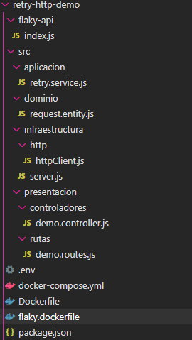
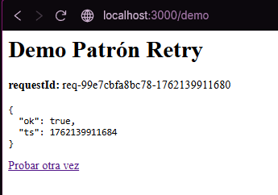

> [0. Acerca del Grupo](../../0.md) › [0.7. Trabajo Individual (Patrones Cloud)](../0.7.md) › [0.7.4. Integrante 4](0.7.4.md)

# 0.7.4. Carolina Meza

## **Patron retry**

# Problema
En sistemas distribuidos, muchas fallas son transitorias (latencia, timeouts, errores 5xx, límites de tasa 429, pérdidas momentáneas de red). Si el cliente falla “de frente” o reintenta de inmediato y en masa, puede provocar tormentas de reintentos y agravar la indisponibilidad. El patrón Retry aborda precisamente el manejo de fallas transitorias para mejorar estabilidad y disponibilidad sin saturar la dependencia.

# Solución
La idea es envolver llamadas remotas con una política de reintentos que:
- Clasifica errores “retryable” (p. ej., 408/429/5xx, errores de socket, lectura/escritura) versus no-reintentables (400, 401, 403, validaciones).
- Aplica exponential backoff con jitter (aleatoriedad) para evitar sincronización de clientes (herd effect).
- Establece límites (máx. intentos y backoff máximo) y métricas para observar el comportamiento.
- Se combina con timeouts y, si corresponde, circuit breaker para permitir recuperación del servicio.
- AWS recomienda exponential backoff + jitter (full/equal jitter) y documenta por qué sin jitter los clientes se sincronizan; sus SDK ya incluyen estrategias estándar/adaptivas.
- Google Cloud enfatiza que idempotencia y retries van de la mano; varios servicios exigen backoff exponencial y orientan a marcar qué operaciones son retryable.

# Casos de Aplicación
**1. Fintech/e-commerce (Pagos y cobros)**
- **Problema:** confirmaciones de pago fallan por timeouts o 5xx del PSP.
- **Aplicación:** reintentos con backoff + idempotency keys para evitar cargos duplicados; validar con métricas de éxito tras reintento. (Buenas prácticas públicas de Google/Cloud Run y terceros sobre idempotencia en APIs como Stripe).

**2.APIs de plataforma de pagos/estándares de conectividad**
- **Problema:**políticas del proveedor exigen retry con backoff y prohíben cachear errores.
- **Aplicación:**  adoptar exponential backoff según lineamientos de la plataforma para cumplir SLAs y no sobrecargar

## Aplicación en su Proyecto Grupal:
**Módulo Generación de Playlist (Spotify):** Se implementa Retry con backoff exponencial + jitter para reintentar llamadas a la API de Spotify cuando ocurren fallas transitorias (timeouts, 429, 5xx). Antes, la creación de playlists fallaba en picos de demanda; con Retry e idempotency-key para evitar duplicados, se espera elevar la tasa de éxito ≥ 99.5% y mantener p95 ≤ 1.2 s incluso ante rate limiting. La validación se hará con k6 (inyectando 1–3% de timeouts/429) y monitoreo de retries_total, retry_reason y latencia p95 en el dashboard.

**Integración con Plataformas Externas (Spotify):** Se habilita Retry respetando Retry-After cuando apliquen límites de tasa, con circuit breaker para degradaciones sostenidas y fallback (una previsualización local) si la dependencia no responde. Se espera mantener la disponibilidad ≥ 99.9% del flujo de “guardar playlist” y que el breaker no permanezca abierto > 60 s. La validación se hará con fallas inyectadas (429/5xx) y monitoreo de breaker_state, retry_delay_ms_sum y tasa de éxito post-retry.

## Desarrollo de Código y Demo
La siguiente estructura muestra cómo se organiza la demo retry-http-demo, siguiendo una arquitectura por capas.

# Requisitos Previos
-Node.js v18+
-Docker

# Demo

**Ejecutar la demo**
1. Clonar el repo: https://github.com/ulima-arqsoft/arqui252-meza-beraun/retry-http-demo
2. Navegar a la carpeta del proyecto: 
cd retry-http-demo
3. Levantar los servicios con Docker Compose: docker compose up --build
4. Abrir en el navegador: http://localhost:3000/demo

5. Observar en consola de retry-api los logs de reintentos: 
[retry] intento #1 status=429 delay=1176ms
[retry] intento #2 status=503 delay=2390ms
6. La página muestra el resultado final: cuando se logra 200 OK del proveedor, verás el JSON; si se agotan los intentos, verás un mensaje de error final (502) indicando que el Retry fue insuficiente por fallas persistentes.

[⬅️ Anterior](../0.7.3/0.7.3.md) | [🏠 Home](../../../README.md) | [Siguiente ➡️](../0.7.5/0.7.5.md)