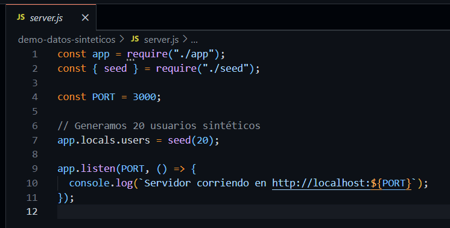
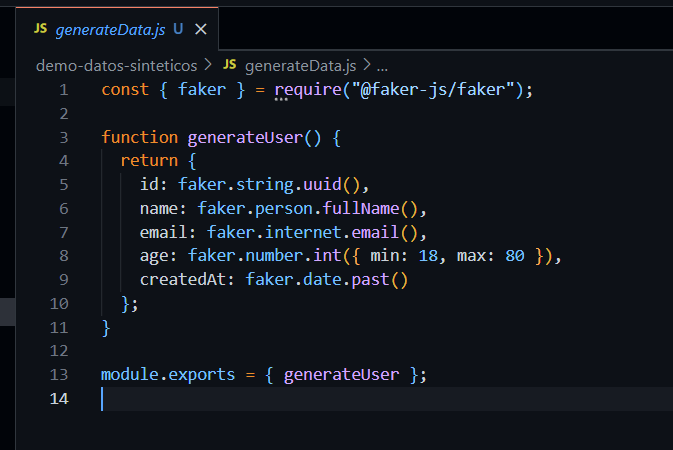
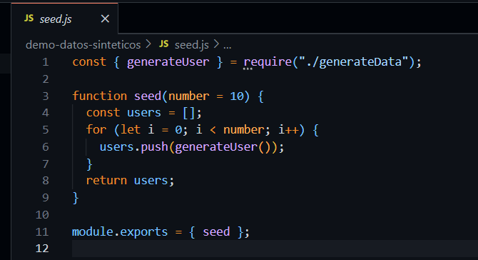
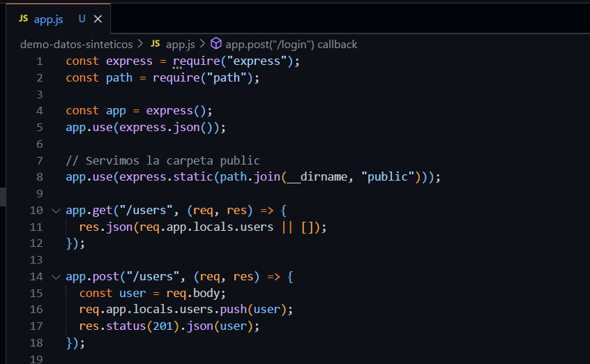
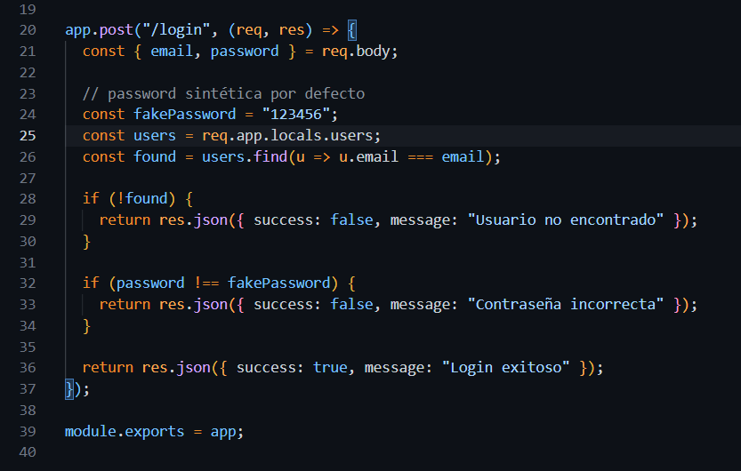
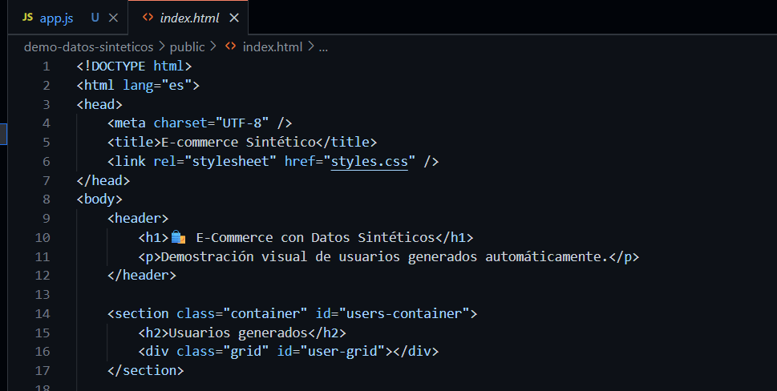
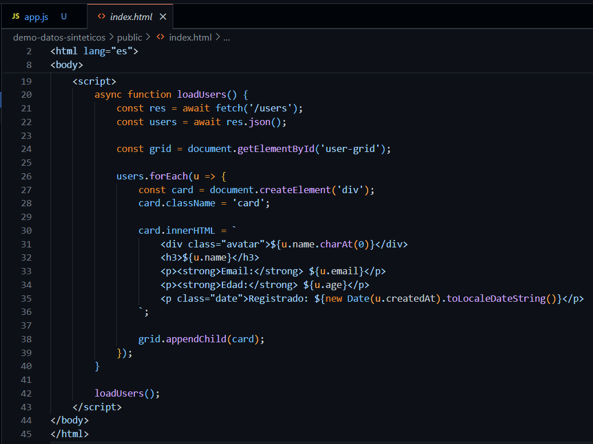
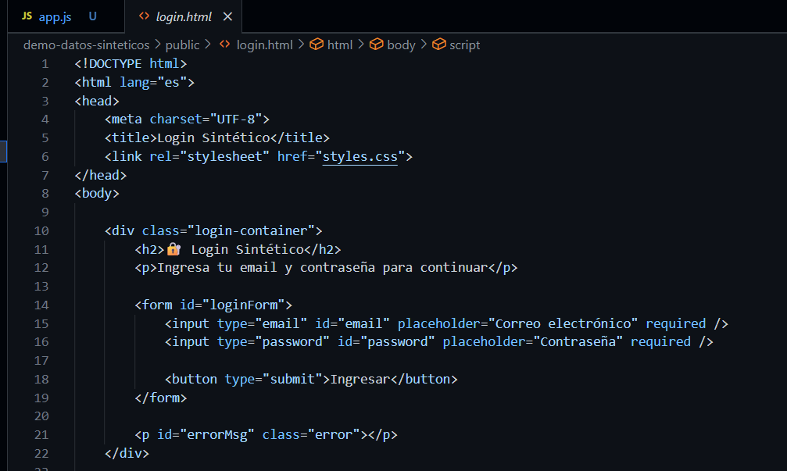
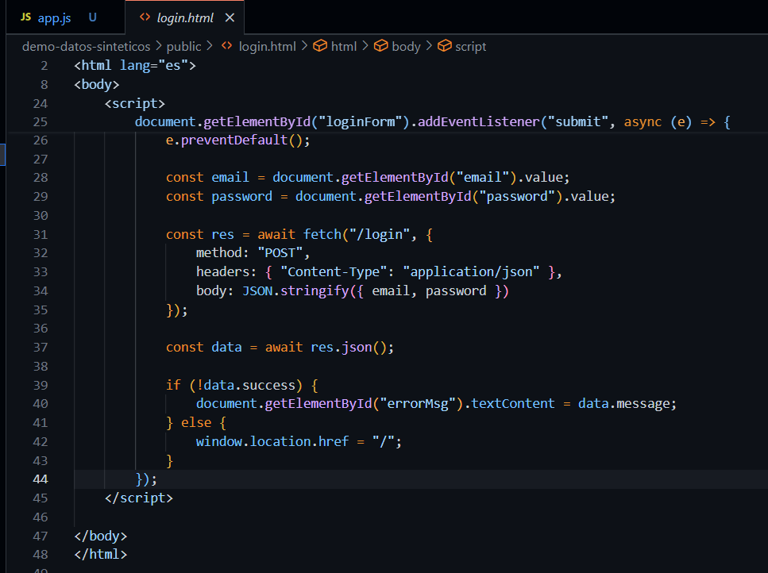
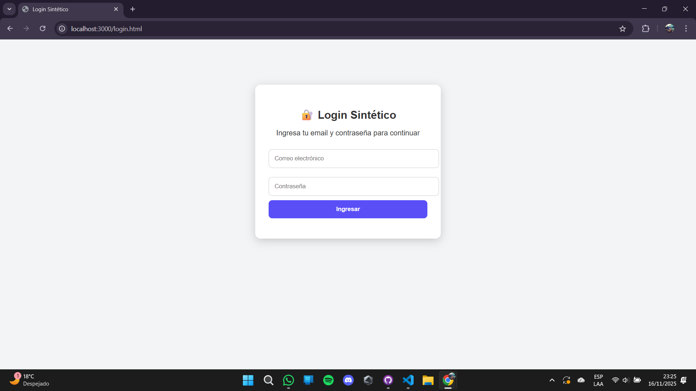

> [0. Acerca del Grupo](../../0.md) › [0.8. Temas Individuales (Parte 2)](../0.8.md) › [0.8.2. Integrante 2](0.8.2.md)

# 0.8.2 Pedro Morales

# Generación de Datos Sintéticos para Pruebas (Pruebas de Software)

## 🧑🏻‍💻 Desarrollo Conceptual

### ¿Qué es la Generación de Datos Sintéticos?

La **Generación de Datos Sintéticos** consiste en crear datos **artificiales**, producidos mediante algoritmos, modelos estadísticos o reglas programadas, entonces el objetivo clave es **simular información real sin exponer datos sensibles** ni depender de bases de datos productivas.

Estos datos replican **características, patrones y comportamientos** de los datos reales, pero no pertenecen a personas ni transacciones reales.  
Se utilizan en **pruebas de software, QA, desarrollo, automatización y validación**, permitiendo probar sistemas sin afectar la privacidad.

Aplicado a las pruebas, los datos sintéticos permiten:

- **Probar funcionalidades sin usar datos reales.**
- **Simular escenarios poco frecuentes o extremos.**
- **Aumentar la cobertura de pruebas.**
- **Cumplir normas de privacidad** como GDPR o la Ley de Protección de Datos.

### 🎯 Objetivos de la Generación de Datos Sintéticos

- **Evitar el uso de datos reales:** Protege información sensible.
- **Generar variedad de casos:** Errores, límites, cargas altas.
- **Asegurar repetibilidad:** Mis pruebas = mismos datos = mismos resultados.
- **Reducir tiempos y costos:** No requiere extracción ni anonimización.
- **Mejorar calidad del software:** Más escenarios, mayor confiabilidad.
- **Cumplir la normativa:** Riesgo cero de exposición de datos reales.

### 🧱 Arquitectura Conceptual  
*(pirámide conceptual de niveles)*

| Capa / Nivel | Qué Representa | Ejemplo Aplicado |
|--------------|----------------|------------------|
| **Modelado de Datos (Base)** | Estructura, tipos y relaciones | Tabla “Clientes” con nombre, fecha nacimiento, email |
| **Reglas y Patrones** | Coherencia y restricciones | DNIs válidos, emails correctos, fechas cronológicas |
| **Método de Generación** | Técnica utilizada | Aleatoria, estadística, plantillas, IA generativa |
| **Validación y Calidad** | Asegurar consistencia | Formatos correctos, cardinalidad, rangos válidos |
| **Integración con Pruebas** | Consumo de los datos | QA automation, CI/CD, mocks, seeds |

> **Importante:** Los datos sintéticos deben conservar la **estructura real**, sin exponer jamás información verdadera.

### 📊 Métricas Clave

- **Cobertura de Datos:** Escenarios cubiertos con datos sintéticos.  
- **Diversidad y Completitud:** Variedad de casos generados.  
- **Consistencia:** Porcentaje de datos que cumplen las reglas.  
- **Tiempo de Generación:** Rapidez en crear datasets completos.  
- **Repetibilidad (Seed):** Capacidad de replicar un mismo dataset.

### 🛠️ Criterios para Diseñar Datos Sintéticos

- **Analizar los datos reales:** Tipos, relaciones y cardinalidad.  
- **Definir reglas de negocio:** Longitudes, unicidad, restricciones.  
- **Elegir método adecuado:** Random, reglas, estadístico o IA.  
- **Garantizar diversidad:** Casos normales + bordes + errores.  
- **Automatizar la generación:** Integrarlo en pipelines CI/CD.  
- **Verificar privacidad absoluta:** No usar ni derivar datos reales.


## 👾 Consideraciones Técnicas

En términos prácticos, **Faker** es:

- Generar datos artificiales para simular usuarios, productos, pedidos, etc.
- Probar funcionalidades del sistema sin depender de datos reales.
- Asegurar la integridad del entorno de pruebas manteniendo los datos ficticios aislados.

Ejemplo: Si se crea un **login con usuarios generados por Faker**, el **sistema de autenticación** y las **funcionalidades de la página eCommerce siguen operando sin comprometer datos sensibles**.

Como analogía es como crear un "entorno controlado": "*Puedes probar todo el sistema sin que afecte a los usuarios reales ni comprometa sus datos*"

---
---

## 1. Requisitos Previos

Antes de comenzar, necesitas instalar lo siguiente:

1. **Node.js**  
   - Es un entorno de ejecución para JavaScript.  
   - Descárgalo desde [https://nodejs.org](https://nodejs.org) e instala la versión recomendada.  
   - Para verificar que está instalado, abre una terminal y ejecuta:
     ```bash
     node -v
     npm -v
     ```

2. **Editor de código**  
   - Se recomienda **Visual Studio Code (VSCode)**.  
   - Descárgalo desde [https://code.visualstudio.com](https://code.visualstudio.com).
   - Pluggins recomendados: ESLint, Prettier y Material Icon Theme.

## 2. Crear el Proyecto

1. Abre la terminal o PowerShell.
2. Crea una carpeta y navega a ella:
   ```bash
    mkdir demo-datos-sinteticos
    cd demo-datos-sinteticos
    ```
3. Inicializa el Proyecto en Node.js
    ```bash
   npm init -y
    ```

## 3. Instalar **Express, Faker y Herramientas de Test**

1. Instala Express (API para exponer los datos) y Faker (para generar datos sintéticos):
    ```bash
    npm install express @faker-js/faker
    ```
2. Instala herramientas de Test (automatización de pruebas usando esos datos):
    ```bash
    npm install jest supertest --save-dev
    ```

## 4. Estructura de Carpetas Recomendada

    demo-datos-sinteticos/
    ├── public/
    │   ├── index.html
    │   ├── login.html
    │   └── styles.css
    │
    ├── generateData.js
    ├── seed.js
    ├── app.js
    ├── server.js
    │
    ├── tests/
    │   └── app.test.js
    │
    └── package.json

## 5. Configurar el Servidor Principal

Puntos clave:
- Generan usuarios sintéticos
- Cargan en app.locals
- Arranca el servidor en el puerto 3000

- server.js



## 6. Configurar los Servicios Internos

En este demo, tus “servicios” son:

- generateData.js



Genera un usuario sintético por vez.

- seed.js



Genera un lote de usuarios sintéticos.

- app.js

Expone endpoints:
- /users → listar
- /login → login sintético
- archivos de public/ como frontend




## 7. Crear y Mostrar las Vistas

- index.html




Presentación:


- login.html




Presentación:


## 8. Ejecutar el Proyecto

Inicia el servidor:

    npm start

Rutas de acceso:

🔹 Página principal (ecommerce sintético)

    http://localhost:3000/

🔹 Login sintético

    http://localhost:3000/login.html

🔹 Ver JSON de usuarios sintéticos

    http://localhost:3000/users

---

## 👾 Demo Código

Link de Github del Proyecto:
https://github.com/PedroM48/arq-individual03-pedro.git

---

[⬅️ Anterior](../0.8.1/0.8.1.md) | [🏠 Home](../../../README.md) | [Siguiente ➡️](../0.8.3/0.8.3.md)