> [0. Acerca del Grupo](../../0.md) › [0.8. Temas Individuales (Parte 2)](../0.8.md) › [0.8.3. Integrante 3](0.8.3.md)

# 0.8.3. Leonardo Salazar
# Desarrollo Conceptual de Headless CMS

# 1. ¿Qué es un Headless CMS?

Un **Headless CMS** es un sistema de gestión de contenido desacoplado, donde el backend y el frontend operan de manera independiente.

En lugar de renderizar páginas completas, el CMS expone el contenido mediante APIs REST o GraphQL, permitiendo que cualquier tipo de aplicación (web, móvil, IoT, SPA) consuma y presente la información según su propia lógica.

### En este enfoque:
- El **backend** administra el contenido (modelos, campos, relaciones, permisos y media).  
- El **frontend** decide cómo mostrarlo, sin depender de plantillas o restricciones del CMS.

Dentro de este paradigma, **Strapi** es uno de los Headless CMS más utilizados gracias a que es:

- open-source  
- autohospedado  
- altamente extensible  
- construido sobre Node.js  

Permite crear APIs completas de manera rápida y flexible, con control total sobre la data y la infraestructura.

---

# 2. Origen y contexto

El concepto de **headless** surge como respuesta a la evolución del frontend moderno.

Los CMS monolíticos tradicionales (WordPress, Drupal) combinaban administración y presentación en un solo sistema, pero el uso creciente de frameworks como **React, Vue, Angular y Next.js** generó la necesidad de consumir contenido mediante APIs.

Esto impulsó arquitecturas:

- desacopladas  
- escalables  
- reutilizables en múltiples canales  
- compatibles con Jamstack y microservicios  

**Strapi** nace en 2015 como un proyecto open-source orientado a ofrecer un backend totalmente configurable, permitiendo:

- crear modelos de contenido  
- definir relaciones complejas  
- extender APIs mediante controladores personalizados  
- integrar autenticación y roles  
- administrar contenido con una UI intuitiva  

Hoy, Strapi es clave en proyectos que requieren agilidad, flexibilidad y control del backend sin depender de proveedores externos.

---

# 3. Ventajas y desventajas

| Ventajas | Desventajas |
|---------|-------------|
| **Open-source y self-hosted:** control total sobre infraestructura y costos. | Debes encargarte del hosting, actualizaciones y seguridad. |
| **APIs automáticas** (REST/GraphQL) generadas a partir de modelos. | La configuración inicial puede ser compleja si hay muchas relaciones. |
| **Altamente extensible** mediante controladores, servicios, middlewares y plugins. | Requiere conocimientos de Node.js para personalizaciones avanzadas. |
| **Panel administrativo claro** para gestionar contenido. | No incluye CDN global de forma nativa. |
| **Integración nativa de autenticación y roles.** | Escalar a producción requiere una arquitectura adecuada. |

---
# 4. Aplicación en el proyecto

Para demostrar el uso de un Headless CMS, se desarrolló **ContentHub Lite**, una demo que separa completamente el backend (Strapi) del frontend (React).  
El objetivo fue mostrar cómo Strapi centraliza la gestión de contenido y expone APIs limpias consumibles por cualquier cliente.

---

## 4.1. Backend con Strapi

En Strapi se configuró un backend funcional con tres **Content Types**:

- **Articles:** título, contenido, imagen, categoría y fecha.  
- **Categories:** clasificaciones para agrupar artículos.  
- **Feedback:** comentarios enviados por los usuarios desde el frontend.

### Configuraciones realizadas:
- Relaciones (un artículo pertenece a una categoría).  
- Permisos (lectura pública para artículos y categorías; creación de feedback protegida).  
- Validación de formatos, campos obligatorios y estructura de los datos.

---

## 4.2. Funcionalidad demostrada

La demo incluye tres interacciones principales:

### 1. Listado dinámico de artículos  
El frontend obtiene artículos desde la API usando:  
`GET /api/articles?populate=*`

### 2. Detalle de un artículo  
Información completa mediante:  
`GET /api/articles/:id`


Cada cambio en Strapi se refleja automáticamente en el frontend, sin necesidad de despliegues adicionales.

---

## 4.3. Frontend (React)

El frontend consume las APIs de Strapi mediante hooks especializados, manejando estados de carga y error.  
La interfaz permite:

- visualizar artículos  
- ver detalles  

React **no almacena contenido**; solo lo consume.  
Strapi es la única fuente de información.

---

## 4.4 Resultado

**ContentHub Lite demuestra el valor práctico de Strapi como Headless CMS:**

- centraliza contenido  
- permite crear modelos sin código complejo  
- expone APIs limpias  
- mantiene el frontend totalmente independiente  

Una arquitectura moderna, simple y flexible para prototipos y aplicaciones reales.

# Consideraciones técnicas

### 1. Requisitos

Tener instalado Docker y Docker Compose. Se puede descargar a traves de este [link](https://www.docker.com/products/docker-desktop/) con la opcion "Download Docker Desktop" y seguir la configuración default


Todos los servicios se levantan de manera automática y consistente gracias a Docker Compose, sin necesidad de instalaciones extras.

## 2. Configuración

Clonar el repositorio del proyecto:

```bash
git clone https://github.com/ulima-arqsoft/arqui252-grupo5.git
```

y luego entrar en la carpeta donde se encuentra el proyecto con:

```bash
cd 0/0.8/0.8.3/contenthub-lite
```

Por ultimo, se tendran que crear 1 archivo **.env**

que debe ir dentro de la carpeta backend y debe tener:

```bash

# Server
HOST=0.0.0.0
PORT=1338

# Secrets
APP_KEYS=+3ZHWiZG9PF0GEzTNT9o5w==,ncQUyned9wKlfd9welxZ2Q==,3OOhj67tgOtLvoGYCbr0SQ==,PVcwpCLIj6gE/s7zV+8ZMg==
API_TOKEN_SALT=jLmNLNtldUh7+o63JP+5zQ==
ADMIN_JWT_SECRET=SR721ivaYqgoR+tyy0KfHQ==
TRANSFER_TOKEN_SALT=W8Ua6Xuris1nrsxVQfX04g==
ENCRYPTION_KEY=E6QL2MSCGZJKPlyHHAdNcw==

# Database
DATABASE_CLIENT=sqlite
DATABASE_HOST=
DATABASE_PORT=
DATABASE_NAME=
DATABASE_USERNAME=
DATABASE_PASSWORD=
DATABASE_SSL=false
DATABASE_FILENAME=.tmp/data.db
JWT_SECRET=oYcpkUcJO3XYjPEpRpI99g==

```
## 3. Ejecución

Desde la carpeta raíz del módulo, ejecutar:

```bash
docker-compose up
```

Esto iniciará automáticamente los siguientes servicios:

- ⚙️ **Backend stripe** (puerto `1338`)  
- 💻 **Frontend React** (puerto `5173`)  

La ejecución puede visualizarse en **Docker Desktop**

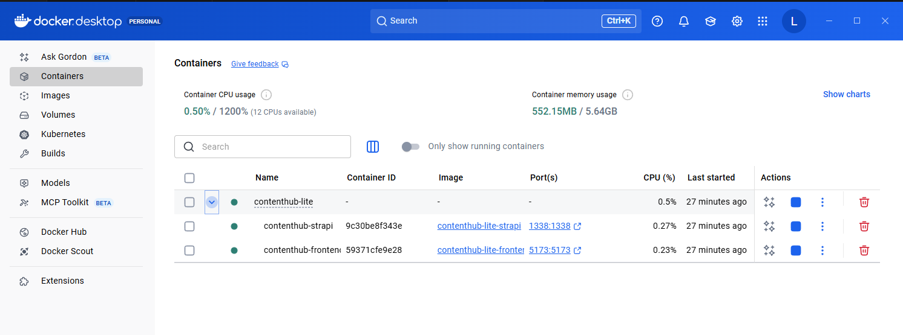

Seleccionando el contenedor contenthub-lite se podra apreciar que todos los servicios se encuentran activos y en ejecución.

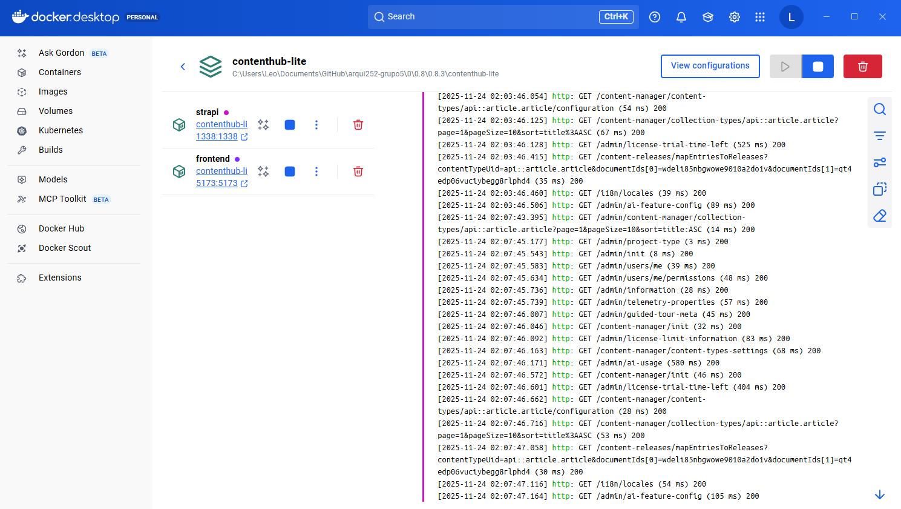

---

## 4. Configuracion 2

Antes de seguir, primero se debe configurar strapi entrando a [http://localhost:1338/admin](http://localhost:1338/admin), una vez abierto, pedira que se loguee con una cuenta de admin nueva (Se puede rellenar con cualquier dato)

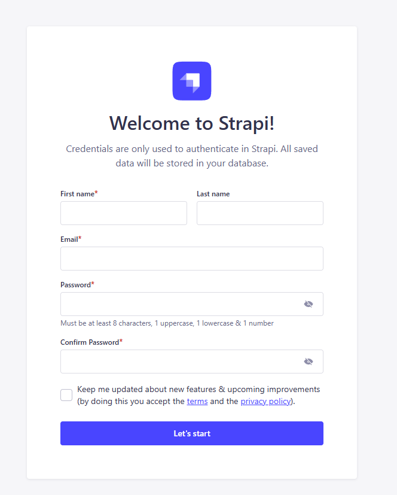

Una vez dentro, se tienen que dirigir hacia "Settings - API Tokens - Read Only"

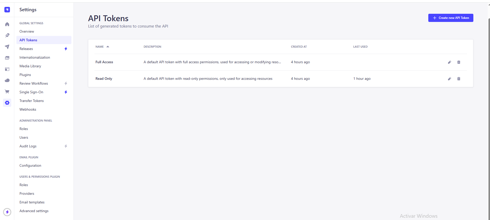

Al darle click encima de "Read Only", tendras que darle al boton de View Token y darle a copy

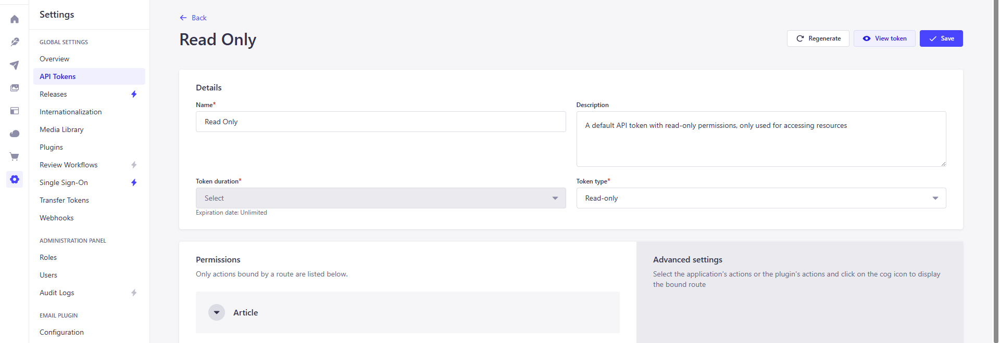

La api-key copiada se pega dentro de este archivo: "contenthub-lite\frontend\src\api.js"

justamente dentro de las comillas y donde dice PONER API TOKEN

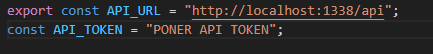

Una vez realizado esto, se apaga un momento la corrida de los servicios con ctrl+ c y en la terminal se debe colocar:
```bash
docker compose build --no-cache frontend
```
y luego se vuelve a prender
```bash
docker-compose up
```
---

## 5. Preparación para pruebas

Tener abierto en el navegador: 

- [http://localhost:5173](http://localhost:5173) para tener el frontend
- [http://localhost:1338/admin](http://localhost:1338/admin) y loguearte para tener strapi listo

---

## 6. Pruebas de Headless CMS

Primero se crea el Content-Type, esto se realiza dirigiendote a "Content-Type Builder" y dandole al "+" para agregar un nuevo Collection Type

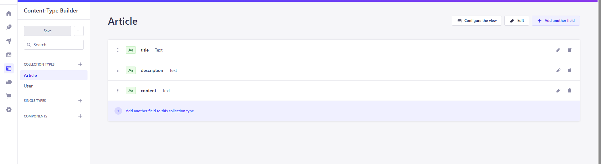

Colocamos "article" como el display name, le damos a continue y por ultimo a "SAVE"

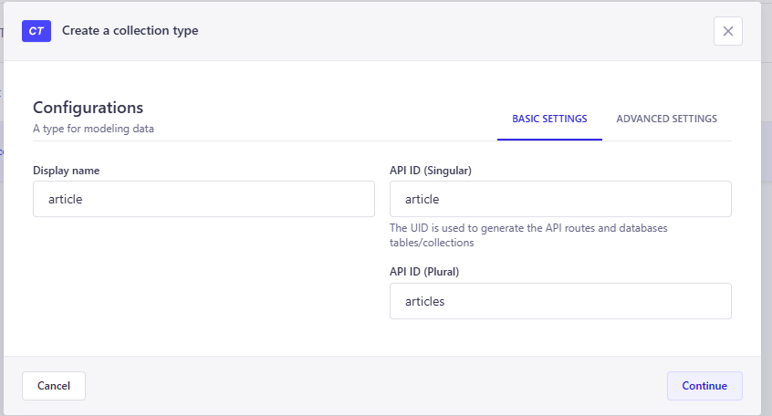

Una vez creado, aparecera en la barra de la izquierda, al darle click, le podremos agregar campos con la opcion de "+ add another field" que se encuentra en la parte superior derecha, teniendo bastante variedad.

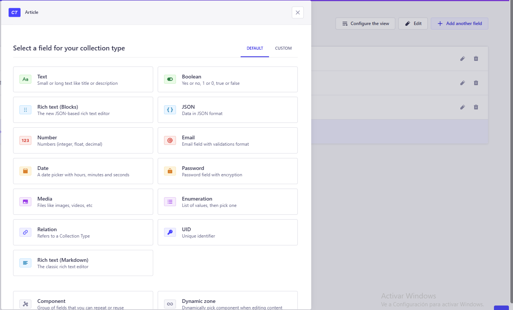

Como este es un ejemplo simple solo crearemos 3 "Text":

- title (short text)
- description (short text)
- content (long text)

Al finalizar se le tiene que dar a "SAVE"

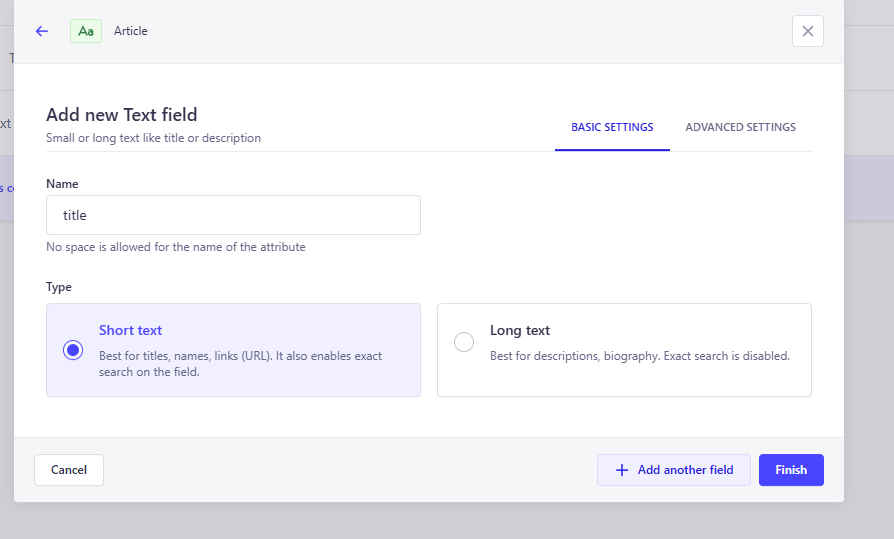

Una vez realizado, nos dirigimos hacia "Content Manager" y seleccionamos el content-type que creamos (article) y le daremos a "+ create new entry"

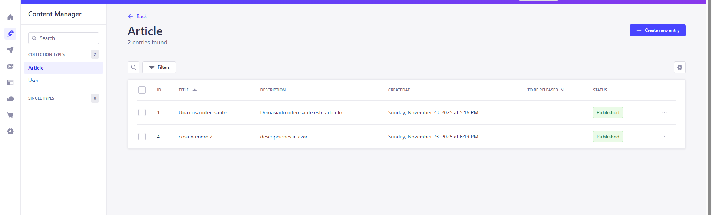

Esta opcion nos permite hacer un nuevo "article", rellenando los campos respectivos de cualquier cosa, luego le damos a "SAVE" y a "Publish" para que estas lleguen a ser detectadas por el frontend

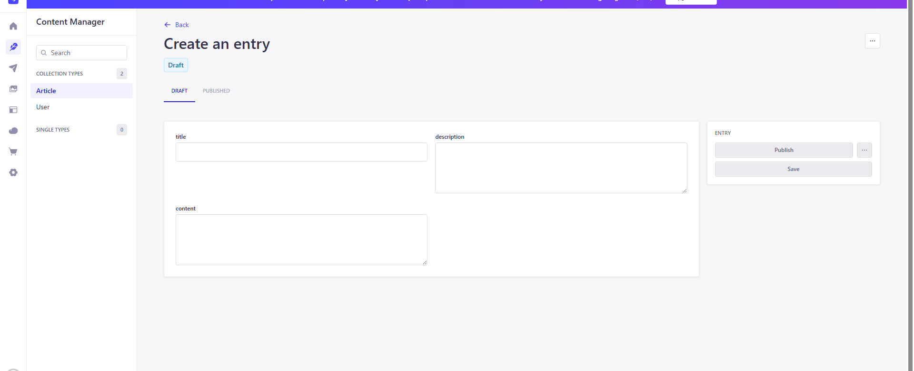

Todo lo "published" se mostrara en el frontend en segundos

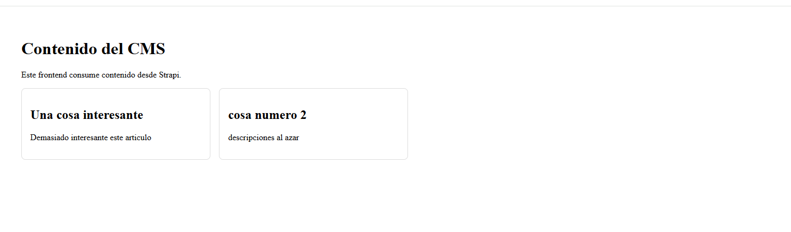

Crear el Content Type “Articulo” permitió estandarizar la estructura del contenido, centralizar su gestión y exponerlo mediante una API limpia para el frontend. Además, agilizó la administración gracias a la UI de Strapi y redujo el desarrollo al generar automáticamente rutas, permisos y controladores básicos.

---
# Video de demostracion

[Link del video](https://youtu.be/owDFjd3WVkY)

---

[⬅️ Anterior](../0.8.2/0.8.2.md) | [🏠 Home](../../../README.md) | [Siguiente ➡️](../0.8.4/0.8.4.md)