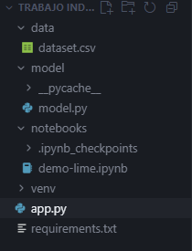
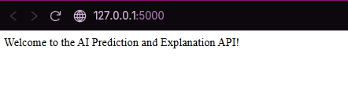
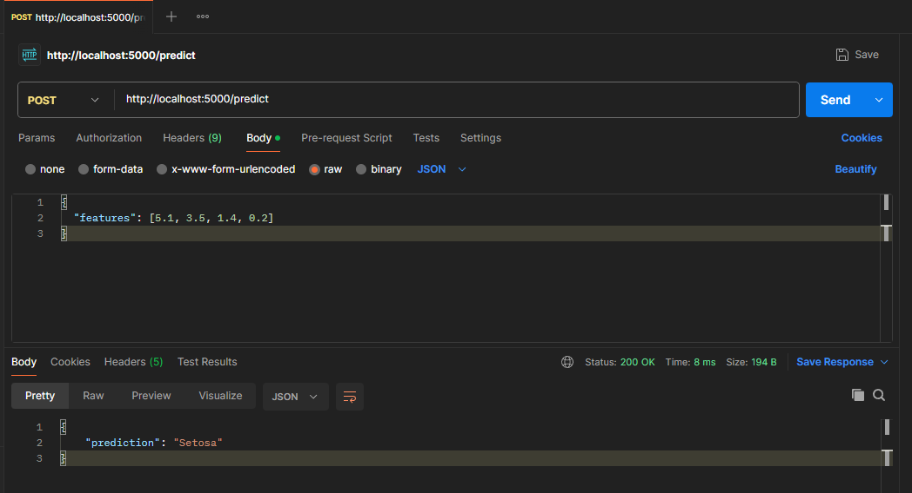
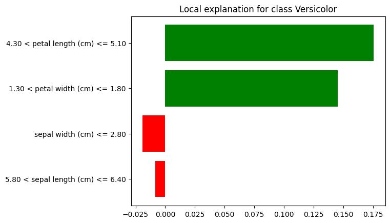

> [0. Acerca del Grupo](../../0.md) › [0.8. Temas Individuales (Parte 2)](../0.8.md) › [0.8.4. Integrante 4](0.8.4.md)

# 0.8.4. Carolina Meza

## 🧑🏻‍💻 Desarrollo Conceptual

### ¿Qué es la Explicabilidad en Modelos de IA?

La **Explicabilidad en Modelos de Inteligencia Artificial (IA)** se refiere a la capacidad de entender y explicar las decisiones tomadas por un modelo de IA. En otras palabras, es el proceso de hacer que los resultados de un modelo sean comprensibles para los humanos, permitiendo que los usuarios o desarrolladores puedan seguir cómo se llegaron a las conclusiones del modelo. Este concepto es fundamental para **garantizar la transparencia**, **confianza** y **justicia** en los sistemas basados en IA, especialmente en aplicaciones sensibles como la medicina, las finanzas o la justicia.

### 🎯 Objetivos de la Explicabilidad en Modelos de IA

- **Mejorar la transparencia:** Hacer que el funcionamiento interno del modelo sea entendible.
- **Generar confianza:** Asegurar que los usuarios comprendan cómo y por qué se tomaron las decisiones.
- **Identificar y corregir sesgos:** Detectar posibles prejuicios en los modelos y tomar acciones correctivas.
- **Cumplir con regulaciones:** Satisfacer normativas como GDPR que requieren explicaciones claras sobre las decisiones automatizadas.
- **Mejorar la toma de decisiones:** Permitir que los humanos comprendan y validen los resultados para tomar decisiones informadas.

### 🧱 Arquitectura Conceptual  
*(pirámide conceptual de niveles)*

| Capa / Nivel                | Qué Representa                                      | Ejemplo Aplicado                                                   |
|-----------------------------|-----------------------------------------------------|-------------------------------------------------------------------|
| **Datos de Entrada**        | Información utilizada para entrenar el modelo      | Imágenes de radiografías para diagnóstico médico                  |
| **Modelo de IA**            | Algoritmo que procesa y genera la predicción        | Red neuronal convolucional (CNN) para clasificación de imágenes   |
| **Método de Explicación**   | Técnicas usadas para desentrañar el modelo         | SHAP (Shapley Additive Explanations), LIME (Local Interpretable Model-agnostic Explanations) |
| **Interpretación de Resultados** | Análisis humano de las explicaciones generadas | Visualización de las características clave que impactaron la predicción |
| **Validación y Justificación** | Asegurar que la explicación sea adecuada         | Evaluación de la fidelidad de las explicaciones mediante auditorías externas |

> **Importante:** La explicabilidad no solo se enfoca en qué hace el modelo, sino también en por qué y cómo llega a sus decisiones.

### 📊 Métricas Clave

- **Interpretabilidad:** Facilidad con la que los resultados del modelo pueden ser comprendidos por los humanos.  
- **Consistencia:** Estabilidad de las explicaciones ante datos similares.  
- **Fidelidad:** Grado en que la explicación refleja el comportamiento real del modelo.  
- **Precisión de la Explicación:** Cuánto de la predicción puede explicarse de manera clara y coherente.  
- **Impacto del Modelo:** Nivel de confianza que los usuarios ganan al comprender el proceso de toma de decisiones del modelo.

### 🛠️ Criterios para Diseñar Explicabilidad en Modelos de IA

- **Seleccionar el tipo de modelo adecuado:** Algunos modelos son naturalmente más explicables que otros (p. ej., árboles de decisión vs. redes neuronales profundas).
- **Definir las variables clave:** Identificar qué factores son relevantes para la toma de decisiones del modelo.
- **Elegir técnicas de explicación apropiadas:** Métodos como LIME, SHAP o representaciones visuales para hacer el modelo más comprensible.
- **Garantizar la transparencia:** Hacer visible el funcionamiento interno del modelo sin perder precisión.
- **Automatizar la generación de explicaciones:** Integrar la explicabilidad dentro del pipeline de desarrollo y en la interfaz de usuario.
- **Verificar la justicia y la ética:** Asegurarse de que las explicaciones sean justas, sin sesgos discriminatorios.

## 👾 Consideraciones Técnicas

En términos prácticos, **la explicabilidad en IA** es comparable a **un asistente que explica decisiones complejas**:

- **Modelo de caja negra**: Un modelo de IA sin explicabilidad es como un "caja negra", donde la entrada va, pero no sabemos exactamente cómo se toma la decisión.
- **Modelo explicable**: Con explicabilidad, es como tener un "consejero" que te muestra el camino que tomó para llegar a la conclusión final, detallando los puntos importantes que influyeron en la decisión.

Estas consideraciones están pensadas para equipos que comienzan a integrar IA explicable en sus sistemas y buscan aumentar la confianza y cumplimiento en sistemas automatizados críticos.

---
## Demo
## 1. Requisitos Previos

Antes de comenzar, necesitas instalar lo siguiente:

1. **Python**  
   - Asegúrate de tener Python instalado en tu sistema.  
   - Para verificar que está instalado, abre una terminal y ejecuta:
     ```bash
     python --version
     pip --version
     ```

2. **Editor de código**  
   - Se recomienda **Visual Studio Code (VSCode)** para el desarrollo.  
   - Plugins recomendados: Python, Jupyter, Pylance.

## 2. Crear un Entorno Virtual

1. Abre la terminal o PowerShell.
2. Crea un entorno virtual y actívalo:
    ```bash
    python -m venv venv
    source venv/bin/activate   # Para Linux o macOS
    venv\Scripts\activate      # Para Windows
    ```

## 3. Instalar Librerías Necesarias

1. Instala las librerías necesarias para el proyecto:
    ```bash
    pip install lime scikit-learn numpy pandas matplotlib
    ```

2. Instala Jupyter Notebook para ejecutar el demo interactivo:
    ```bash
    pip install jupyterlab
    ```
    Instala flask gaa
3. pip install flask lime matplotlib scikit-learn pandas

## 4. Estructura de Archivos Recomendados

    demo-explicabilidad-ia/
    ├── data/
    │   └── dataset.csv
    ├── notebooks/
    │   └── demo-lime.ipynb
    ├── model/
    │   └── model.py
    ├── app.py
    └── requirements.txt
    

## 5. Cargar el Dataset y Entrenar el Modelo

5.1 En el archivo model.py, se utiliza el conjunto de datos Iris de scikit-learn para entrenar un modelo de clasificación utilizando Random Forest:

```python
# model.py
from sklearn.ensemble import RandomForestClassifier
from sklearn.model_selection import train_test_split
from sklearn.datasets import load_iris
import pandas as pd

# Cargar el dataset Iris
data = load_iris()
X = pd.DataFrame(data.data, columns=data.feature_names)
y = pd.Series(data.target)

# Dividir el dataset en entrenamiento y prueba
X_train, X_test, y_train, y_test = train_test_split(X, y, test_size=0.3, random_state=42)

# Entrenar el modelo
model = RandomForestClassifier(n_estimators=100, random_state=42)
model.fit(X_train, y_train)

# Evaluar el modelo
accuracy = model.score(X_test, y_test)
print(f'Accuracy del modelo: {accuracy}')

5.2 LIME (Local Interpretable Model-Agnostic Explanations) se utiliza para explicar cómo el modelo hace sus predicciones. Se configura un LimeTabularExplainer para explicar las predicciones de la clasificación:

```python
import lime.lime_tabular

# Crear el explicador LIME
explainer = lime.lime_tabular.LimeTabularExplainer(
    training_data=X_train.values,
    training_labels=y_train.values,
    mode='classification',
    class_names=['Setosa', 'Versicolor', 'Virginica'],
    feature_names=X_train.columns,
    discretize_continuous=True
)

5.3 Desarrollar la API con Flask: 
Se crea un servidor con Flask que expone dos rutas para realizar predicciones y generar explicaciones:
- Ruta /predict: Recibe una solicitud POST con las características de una instancia y devuelve la predicción del modelo.
- Ruta /explanation: Recibe una solicitud POST con las características de una instancia y devuelve una explicación generada por LIME.

```python 
ffrom flask import Flask, jsonify, request
import numpy as np
import pandas as pd
from model.model import model, X_train, y_train
import lime
import lime.lime_tabular
import matplotlib.pyplot as plt
from sklearn.datasets import load_iris

app = Flask(__name__)

@app.route('/')
def home():
    return "Welcome to the AI Prediction and Explanation API!"

# Crear el explicador LIME
explainer = lime.lime_tabular.LimeTabularExplainer(
    training_data=X_train.values,
    training_labels=y_train.values,
    mode='classification',
    class_names=['Setosa', 'Versicolor', 'Virginica'],
    feature_names=X_train.columns,
    discretize_continuous=True
)

@app.route('/predict', methods=['POST'])
def predict():
    # Obtener los datos del cuerpo de la solicitud
    data = request.get_json()
    instance = np.array(data['features']).reshape(1, -1)
    
    # Realizar la predicción
    prediction = model.predict(instance)
    predicted_class = prediction[0]
    class_names = ['Setosa', 'Versicolor', 'Virginica']
    predicted_label = class_names[predicted_class]
    
    return jsonify({'prediction': predicted_label})

@app.route('/explanation', methods=['POST'])
def explanation():
    # Obtener los datos del cuerpo de la solicitud
    data = request.get_json()
    instance = np.array(data['features']).reshape(1, -1)
    
    # Generar la explicación con LIME
    explanation = explainer.explain_instance(instance[0], model.predict_proba, num_features=4)
    
    # Mostrar la explicación con matplotlib
    fig = explanation.as_pyplot_figure()
    plt.show()

    return jsonify({'message': 'Explanation displayed successfully!'})

if __name__ == '__main__':
    app.run(debug=True, host='0.0.0.0', port=5000)

5.4 niciar el Servidor Flask :
Ejecuta el archivo app.py para iniciar el servidor Flask: python app.py
--- El servidor Flask estará disponible en http://localhost:5000.


5.5 Realizar Solicitudes a la API: 
Envía una solicitud POST a la ruta /predict con los datos de una instancia para hacer la predicción:
Ejemplo de solicitud (usando Postman):

{
  "features": [5.1, 3.5, 1.4, 0.2]
}

respuesta esperada: 
{
  "prediction": "Setosa"
}



5.6 Obtener una Explicación: 
Envía una solicitud POST a la ruta /explanation para obtener la explicación generada por LIME para una instancia específica:

-Resultado: El gráfico de explicación de LIME se mostrará utilizando matplotlib.

## DEMO GAA

Link de Github del Proyecto:
https://github.com/arqui252-meza-beraun/TRABAJO INDIVIDUAL ARQUI

[⬅️ Anterior](../0.8.3/0.8.3.md) | [🏠 Home](../../../README.md) | [Siguiente ➡️](../0.8.5/0.8.5.md)