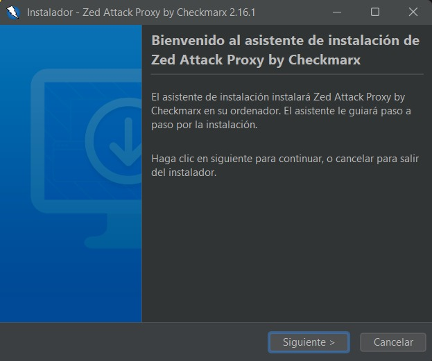
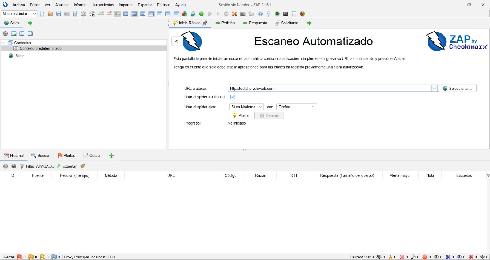
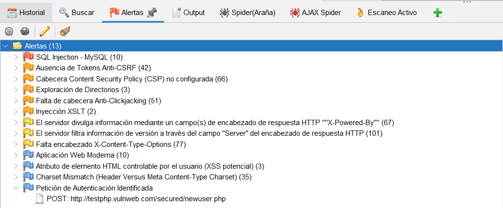
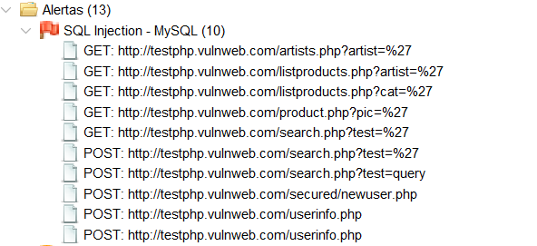
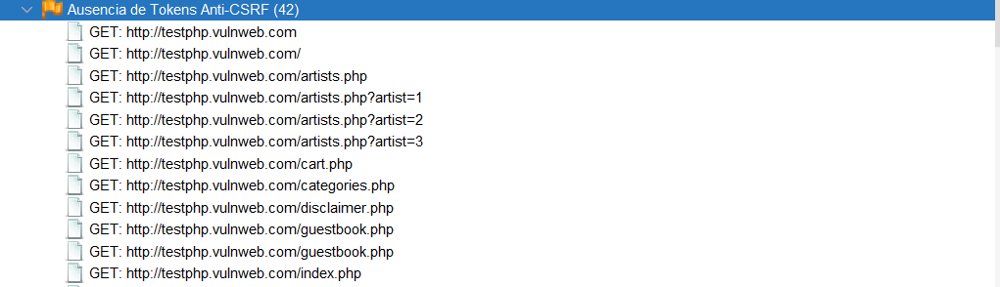
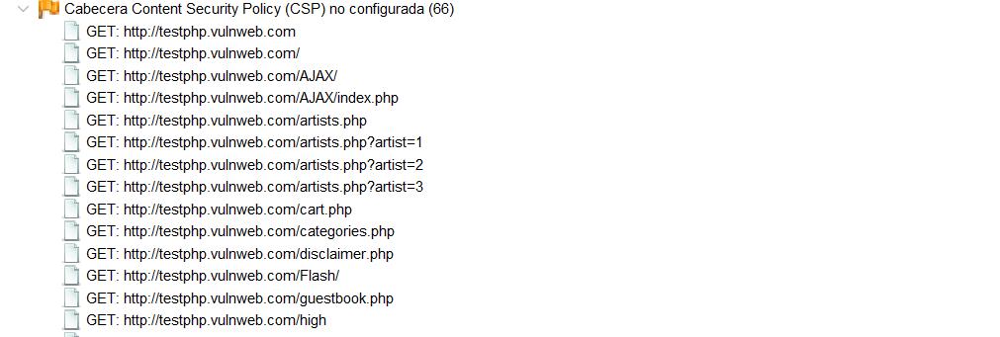
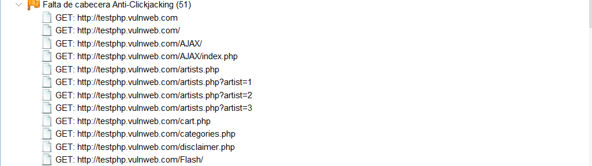
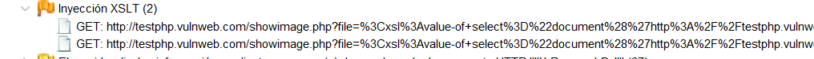
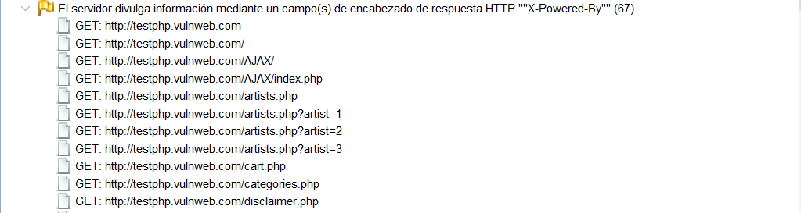
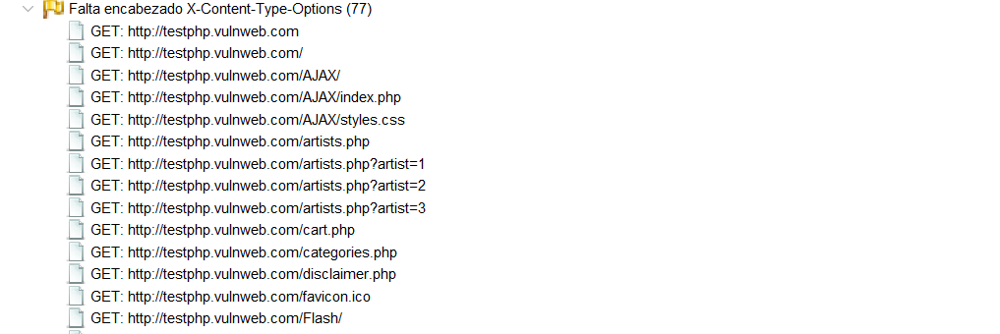

> [0. Acerca del Grupo](../../0.md) › [0.8. Temas Individuales (Parte 2)](../0.8.md) › [0.8.5. Integrante 5](0.8.5.md)

# 0.8.5. Andrew Tamayo Medrano

## Desarrollo Conceptual

### ¿Qué es la Evaluación de Vulnerabilidades con Pentesting?

La **evaluación de vulnerabilidades** mediante **pentesting** (pruebas de penetración) consiste en simular ataques controlados sobre sistemas informáticos para identificar debilidades antes de que sean explotadas por atacantes reales. El objetivo es mejorar la seguridad detectando y corrigiendo vulnerabilidades.

### Objetivos del Pentesting

- **Detectar vulnerabilidades** en sistemas y aplicaciones.
- **Validar controles de seguridad** implementados.
- **Cumplir normativas** y estándares de seguridad.
- **Mejorar la postura de seguridad** de la organización.

### Arquitectura Conceptual

| Nivel              | Qué representa                | Ejemplo aplicado                       |
|--------------------|------------------------------|----------------------------------------|
| Identificación     | Descubrir activos y servicios| Escaneo de puertos con Nmap            |
| Evaluación         | Analizar vulnerabilidades    | Uso de Nessus para escaneo de vulnerabilidades |
| Explotación        | Simular ataques              | Pruebas con Metasploit                 |
| Reporte            | Documentar hallazgos         | Informe de vulnerabilidades             |

---

## Herramienta Utilizada: OWASP ZAP

**OWASP ZAP** (Zed Attack Proxy) es una herramienta gratuita y de código abierto para encontrar vulnerabilidades en aplicaciones web. Es ideal para pentesters y desarrolladores que desean mejorar la seguridad de sus aplicaciones.

### Pasos de la Demo

1. **Instalación de OWASP ZAP**
   - Descargar desde: [https://www.zaproxy.org/download/](https://www.zaproxy.org/download/)
   - Instalar según el sistema operativo (Windows, Mac, Linux).

   

2. **Escaneo Automatizado**
   - Abrir OWASP ZAP y seleccionar "Escaneo Automatizado" en la pantalla principal.
   - Ingresar la URL de una aplicación vulnerable de prueba, por ejemplo: `http://testphp.vulnweb.com`
   - Presionar el botón "Atacar" y esperar a que finalice el análisis.

   

3. **Interpretación de Resultados**
   - Al finalizar el escaneo, ZAP muestra una lista de vulnerabilidades encontradas en la sección de alertas. Algunos ejemplos de los resultados obtenidos:
   
   **SQL Injection - MySQL**
   - ZAP detectó múltiples puntos vulnerables a inyección SQL, por ejemplo:
     - `/artists.php?artist=%27`
     - `/search.php?test=%27`
   - Solución: Validar y sanear todas las entradas del usuario antes de usarlas en consultas SQL.

   

   **Ausencia de Tokens Anti-CSRF**
   - Muchas páginas no implementan protección contra ataques CSRF.
   - Solución: Implementar tokens CSRF en formularios y solicitudes sensibles.

   

   **Cabecera Content Security Policy (CSP) no configurada**
   - No se ha definido una política de seguridad de contenido.
   - Solución: Configurar la cabecera CSP en las respuestas HTTP.

   

   **Falta de cabecera Anti-Clickjacking**
   - Las páginas no tienen protección contra clickjacking.
   - Solución: Añadir la cabecera `X-Frame-Options` o `Content-Security-Policy: frame-ancestors`.

   

   **Inyección XSLT**
   - Se detectaron puntos vulnerables a inyección XSLT.
   - Solución: Validar y sanear entradas relacionadas con XSLT.

   

   **Divulgación de información del servidor**
   - El servidor revela información sobre su versión y tecnología en las cabeceras HTTP (`X-Powered-By`, `Server`).
   - Solución: Configurar el servidor para ocultar estos datos.

   

   **Falta de encabezado X-Content-Type-Options**
   - Sin esta cabecera, el navegador puede interpretar archivos de forma insegura.
   - Solución: Añadir la cabecera `X-Content-Type-Options: nosniff`.

   

   **Atributo HTML controlable por el usuario (XSS potencial)**
   - Hay formularios o parámetros que pueden permitir la ejecución de scripts maliciosos.
   - Solución: Validar y sanear todas las entradas del usuario.

   

   **Petición de Autenticación Identificada**
   - ZAP detectó una solicitud que requiere autenticación.

   

### Conclusión

La evaluación de vulnerabilidades con herramientas de pentesting como OWASP ZAP es fundamental para fortalecer la seguridad de las aplicaciones web. Permite identificar y corregir debilidades antes de que sean explotadas, contribuyendo a una mejor protección de la información.

Además, es importante que las vulnerabilidades detectadas sean priorizadas y corregidas oportunamente, involucrando a los equipos de desarrollo y seguridad. El pentesting debe ser parte de un ciclo continuo de mejora, realizando pruebas periódicas y actualizando las defensas ante nuevas amenazas. Finalmente, todo proceso de pentesting debe realizarse de manera ética y con autorización, respetando la privacidad y la integridad de los sistemas evaluados.

---

[⬅️ Anterior](../0.8.4/0.8.4.md) | [🏠 Home](../../../README.md)