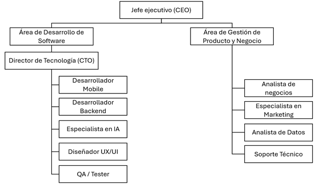

# 1.3. Estructura del Equipo

## 📃 Documentación del Organigrama de Equipo

La organización cuenta con un **CEO** encargado de la visión del negocio y un **CTO** responsable de la estrategia tecnológica.  
Bajo el CTO se distribuyen los equipos de desarrollo: **Mobile, Backend, IA, Tester**. Adicionalmente, se espera tener un apoyo por parte de un **Analista de Negocio** con el fin de tener una mejor investigación de mercado, un **Especialista en Marketing Digital** para poder promocionar más la app móvil, **Analista de Datos** aportando a tener una mejor toma de decisiones y **Soporte Técnico** para tener un mantenimiento una vez lanzada ya la aplicación

---

## 📲 Organigrama

---

## 💼 Puestos Sin Personal (a contratar)

| Cargo                     | Comentario                                                   |
|----------------------------|----------------------------------------------------------------------|
| Arquitecto de Software    | Funciones actualmente cubiertas por Ana Meza                   |
| Analista de Negocio | Funciones actualmente cubiertas por Andrew Tamayo     |
| Analista de Datos         | Funciones actualmente cubiertas por Crisbeth Sovero     |
| Admin. Base de Datos                        | Funciones actualmente cubiertas por Leonardo Salazar     |
| Esoecialista Mark. Digital    | Funciones actualmente cubiertas por Pedro Morales     |

