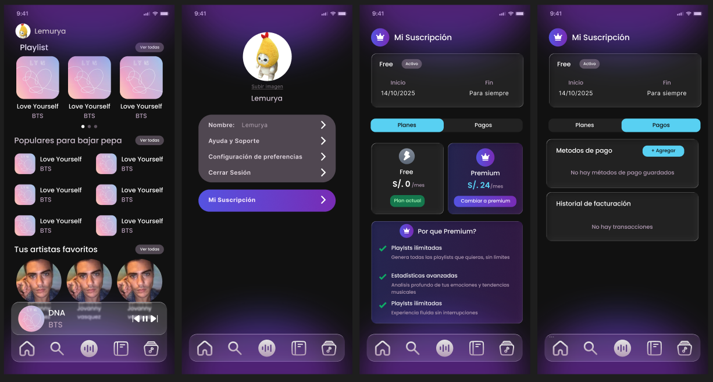

# 2.1.3. Módulo 3

## Gestión de Planes y Suscripciones / Leonardo Salazar

### Requisitos Funcionales

#### RF-SB-01 Catálogo de planes
Free vs Premium (mensual) con tabla de beneficios.  

- **Aceptación:** la UI muestra diferencias (playlists/día, estadísticas, exportaciones).

---

#### RF-SB-02 Checkout seguro
Cobro con pasarela, impuestos y comprobante.  

- **Aceptación:** al pagar, se registra transacción exitosa y plan=Premium.

---

#### RF-SB-03 Renovación automática
Cobro recurrente mensual con recordatorio 3 días antes.  

- **Aceptación:** si el cobro se aprueba, se extiende vigencia 30 días.

---

#### RF-SB-04 Gestión de método de pago
Agregar/quitar tarjeta y definir por defecto.  

- **Aceptación:** al reemplazar tarjeta, los próximos cobros usan el nuevo método.

---

#### RF-SB-05 Dunning (reintentos)
Reintentos automáticos a 1h, 24h y 72h.  

- **Aceptación:** si tras 72h sigue fallando, plan pasa a “en gracia”.

---

#### RF-SB-06 Grace period
7 días de gracia con recordatorios.  

- **Aceptación:** pasado el periodo, se degrada a Free.

---

#### RF-SB-07 Cambio de plan y prorrata
Upgrade/downgrade con prorrateo.  

- **Aceptación:** el usuario ve monto pro-rateado antes de confirmar.

---

#### RF-SB-08 Cancelación
Cancela al final del ciclo.  

- **Aceptación:** mantiene beneficios hasta fecha de corte y no renueva.

---

#### RF-SB-09 Reembolsos
Parcial/total según política.  

- **Aceptación:** al aprobarse, se registra nota de crédito y correo de confirmación.

---

#### RF-SB-10 Enforcements por plan
Límites y features por plan.  

- **Aceptación:** Free: máx. 2 playlists/día; Premium: ilimitado + estadísticas avanzadas.

---

#### RF-SB-11 Facturación
Historial de pagos y descarga de comprobantes.  

- **Aceptación:** cada operación lista fecha, importe, estado y comprobante PDF.

---

#### RF-SB-12 Promociones (futuro)
Cupones, trials y referidos.  

- **Aceptación:** al aplicar cupón válido, se refleja descuento en el total.

## Flujo de pantalla relacionado
 
