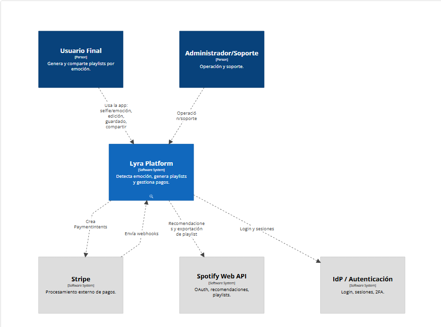

> [6. Documentación de Arquitectura (Bosquejo)](../6.md) › [6.1. Diagrama de Contexto](6.1.md)

# 6.1. Diagrama de Contexto
A continuación, se muestra el diagrama de contexto del aplicativo Lyra:

# Actores

- **Usuario Final:** Usa la app para detectar su emoción (selfie o selección), generar playlists personalizadas, pre-escuchar, editar, guardar, exportar y compartir.
- **Administrador/Soporte:** Supervisa la operación, revisa métricas básicas, atiende incidencias, gestiona anuncios/feature flags y soporte a usuarios.

# Sistemas Externos

- **Spotify Web API:** Autorización OAuth, recomendaciones por audio-features, creación/edición de playlists y lectura de top artists/tracks.
- **IdP / Autenticación:** Login y sesiones (Google/Apple/Spotify/Firebase), 2FA opcional y protección contra brute force.
- **Pasarela de Pagos (PCI):** Checkout, renovaciones, dunning y reembolsos de suscripciones Premium.
- **Servicio de Facturación/Comprobantes:** Emisión y descarga de comprobantes (PDF) de cada transacción.
- **Servicio de Detección de Emoción:** Clasifica la selfie en {feliz, triste, calmado, enérgico, melancólico, ansioso, neutro} con latencia objetivo < 2s (p75). (Si el modelo  corre on-device/propio, este punto se mueve a C2 como interno.)
- **Redes Sociales/Mensajería:** Canales para compartir cover + deep link/QR (IG Stories, TikTok, X, WhatsApp).
- **Servicio de Notificaciones:** Envío de push/email (p. ej., “mood del día”, “playlist semanal”, cambios de plan).
- **Plataforma de Analítica/Telemetría:** Registro anon de emoción, duración, skips, completion rate mediante session_id no sensible.

# Sistema Central

- **App LYRA:** Plataforma que detecta emoción, la mapea a parámetros musicales y genera playlists personalizadas. Ofrece historial/versionado de playlists, preferencias musicales, límites por plan (Free/Premium) y exportación a proveedor musical.
---

[🏠 Home](../../README.md) | [Siguiente ➡️](../6.2/6.2.md)