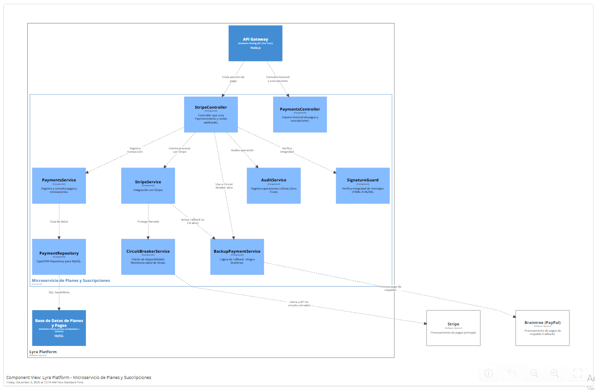

> [6. Documentación de Arquitectura (Bosquejo)](../6.md) › [6.3. Diagrama de Componentes](6.3.md)

# 6.3. Diagrama de Componentes

El siguiente diagrama representa la **arquitectura interna a nivel de componentes** del sistema LYRA, mostrando cómo se estructuran los diferentes módulos y sus interacciones dentro de cada microservicio.

## Diagrama de componentes (Modulo de pagos)

---

[⬅️ Anterior](../6.2/6.2.md) | [🏠 Home](../../README.md) | [Siguiente ➡️](../6.4/6.4.md)